# Quake III Arena — Architectural Study Guide

**Audience:** Graduate-level software engineering students.
**Scope:** The id Tech 3 engine source as released under the GPL on August 20, 2005.
**How to read this:** Mermaid diagrams render in VSCode's markdown preview (`Cmd+Shift+V`). Each section ends with a "Why it matters" callout connecting the design to a course concept (concurrency, distributed systems, sandboxing, software architecture).

---

## 0. Why study Quake III?

id Tech 3 is one of the most-studied engines in the industry. It is small enough to fit in your head (~250 kLOC C), but it solves problems that *still* shape modern game engines and distributed systems:

| Problem | Quake III's answer | Modern descendant |
|---|---|---|
| Run untrusted mod code safely | A custom **bytecode VM** (QVM) with a syscall-only ABI | WebAssembly, eBPF, JavaScript engines |
| Hide network latency | **Client-side prediction + server reconciliation** with a shared `Pmove()` | Rollback netcode (GGPO), CRDTs (in spirit) |
| Move data efficiently across the wire | **Delta-compressed snapshots** of an authoritative entity table | Source engine, Overwatch netcode, Valorant |
| Decouple art from code | **Data-driven shaders** parsed from text scripts | All modern material systems |
| Decouple renderer from engine | **`refexport_t` / `refimport_t`** vtable across a DLL boundary | Any plugin-based architecture |
| Realtime AI nav across complex 3D | **AAS** (precomputed area-awareness mesh) | Recast/Detour, Unreal's NavMesh |

---

## 1. System context (C4 Level 1)

Where the binary sits in the world.

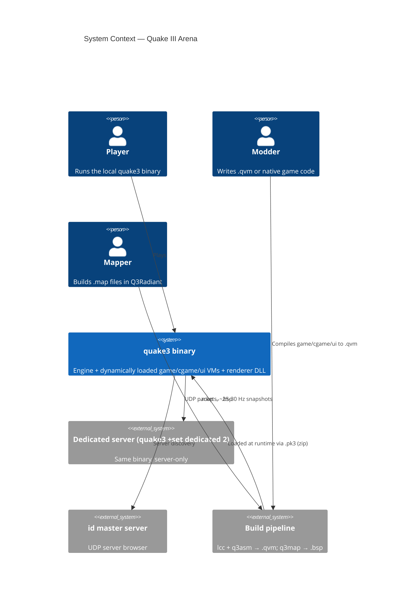
```mermaid
C4Context
title System Context — Quake III Arena
Person(player, "Player", "Runs the local quake3 binary")
Person(modder, "Modder", "Writes .qvm or native game code")
Person(mapper, "Mapper", "Builds .map files in Q3Radiant")

System(q3, "quake3 binary", "Engine + dynamically loaded game/cgame/ui VMs + renderer DLL")
System_Ext(server, "Dedicated server (quake3 +set dedicated 2)", "Same binary, server-only")
System_Ext(masterlist, "id master server", "UDP server browser")
System_Ext(tools, "Build pipeline", "lcc + q3asm → .qvm; q3map → .bsp")

Rel(player, q3, "Plays")
Rel(q3, server, "UDP packets, ~25-30 Hz snapshots")
Rel(q3, masterlist, "Server discovery")
Rel(modder, tools, "Compiles game/cgame/ui to .qvm")
Rel(mapper, tools, ".map → .bsp")
Rel(tools, q3, "Loaded at runtime via .pk3 (zip)")
```

---

## 2. Container diagram (C4 Level 2) — The subsystems

The single `quake3` binary is internally partitioned into ~9 subsystems. Three of them are *sandboxed VMs* loaded at runtime.

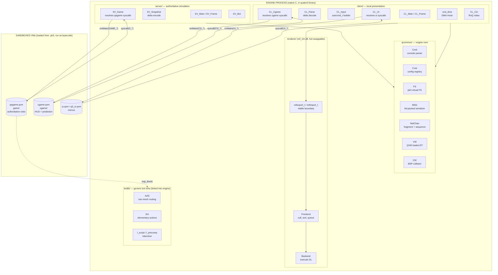
```mermaid
flowchart TB
  subgraph Engine["ENGINE PROCESS (native C, in quake3 binary)"]
    direction TB

    subgraph qcommon["qcommon/  — engine core"]
      Cmd[Cmd<br/>console parser]
      Cvar[Cvar<br/>config registry]
      FS[FS<br/>pk3 virtual FS]
      MSG[MSG<br/>bit-packed serializer]
      NetChan[NetChan<br/>fragment + sequence]
      VM[VM<br/>QVM loader/JIT]
      CM[CM<br/>BSP collision]
    end

    subgraph Server["server/  — authoritative simulation"]
      SVMain[SV_Main / SV_Frame]
      SVSnap[SV_Snapshot<br/>delta encode]
      SVGame[SV_Game<br/>resolves qagame syscalls]
      SVBot[SV_Bot]
    end

    subgraph Client["client/  — local presentation"]
      CLMain[CL_Main / CL_Frame]
      CLParse[CL_Parse<br/>delta decode]
      CLInput[CL_Input<br/>usercmd_t builder]
      CLCgame[CL_Cgame<br/>resolves cgame syscalls]
      CLUI[CL_UI<br/>resolves ui syscalls]
      CLSound[snd_dma<br/>DMA mixer]
      CLCin[CL_Cin<br/>RoQ video]
    end

    subgraph Renderer["renderer/  (ref_trin.dll, hot-swappable)"]
      Refexport["refexport_t / refimport_t<br/>vtable boundary"]
      Frontend[Frontend<br/>cull, sort, queue]
      Backend[Backend<br/>execute GL]
    end

    subgraph Botlib["botlib/  — generic bot infra (linked into engine)"]
      AAS[AAS<br/>nav-mesh routing]
      EA[EA<br/>elementary actions]
      LScript[l_script / l_precomp<br/>tokenizer]
    end
  end

  subgraph VMs["SANDBOXED VMs (loaded from .pk3, run as bytecode)"]
    direction TB
    QAGame[("qagame.qvm<br/>game/<br/>authoritative rules")]
    CGame[("cgame.qvm<br/>cgame/<br/>HUD + prediction")]
    UI[("ui.qvm / q3_ui.qvm<br/>menus")]
  end

  SVGame -- vmMain(GAME_*) --> QAGame
  QAGame -- syscall(G_*) --> SVGame
  CLCgame -- vmMain(CG_*) --> CGame
  CGame -- syscall(CG_*) --> CLCgame
  CLUI   -- vmMain(UI_*) --> UI
  UI     -- syscall(UI_*) --> CLUI

  QAGame -. trap_BotAI .-> Botlib
  Server --> qcommon
  Client --> qcommon
  Client --> Refexport
  Refexport --> Frontend --> Backend
```

**Key insight.** The dotted "syscall" arrows are the only legal communication path between the engine and a VM. Inside the VM, `trap_Printf("hi")` issues an `OP_SYSCALL` instruction with a syscall number; the engine catches it, routes it through `SV_GameSystemCalls` (in [code/server/sv_game.c](code/server/sv_game.c)) or `CL_CgameSystemCalls` (in [code/client/cl_cgame.c](code/client/cl_cgame.c)), and returns the result.

---

## 3. Process & frame loop — the heartbeat

The whole engine is a single-threaded event loop. (The renderer optionally spawns a second thread for SMP backend submission.)

### 3.1 Top-level loop

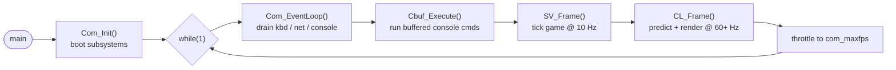
```mermaid
flowchart LR
  start([main]) --> init["Com_Init()<br/>boot subsystems"]
  init --> loop{"while(1)"}
  loop --> evt["Com_EventLoop()<br/>drain kbd / net / console"]
  evt --> cbuf["Cbuf_Execute()<br/>run buffered console cmds"]
  cbuf --> svf["SV_Frame()<br/>tick game @ 10 Hz"]
  svf --> clf["CL_Frame()<br/>predict + render @ 60+ Hz"]
  clf --> sleep["throttle to com_maxfps"]
  sleep --> loop
```

Entry: [code/unix/unix_main.c:1223](code/unix/unix_main.c#L1223) (`main` → `Com_Frame` in [code/qcommon/common.c:2635](code/qcommon/common.c#L2635)).

### 3.2 One server tick — the sequence

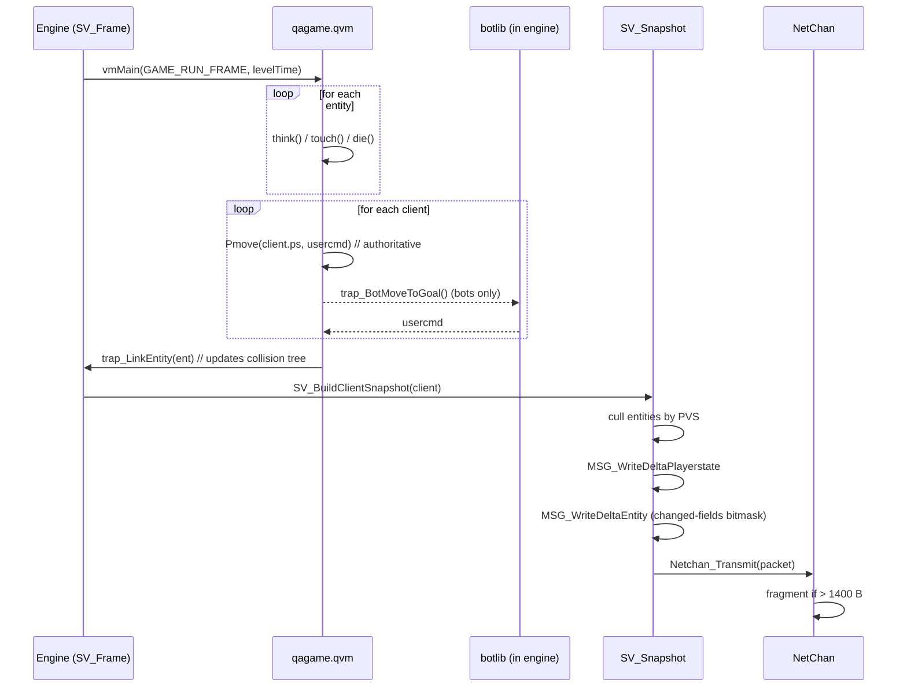
```mermaid
sequenceDiagram
    participant Engine as Engine (SV_Frame)
    participant QAGame as qagame.qvm
    participant Botlib as botlib (in engine)
    participant Snap as SV_Snapshot
    participant Net as NetChan

    Engine->>QAGame: vmMain(GAME_RUN_FRAME, levelTime)
    loop for each entity
        QAGame->>QAGame: think() / touch() / die()
    end
    loop for each client
        QAGame->>QAGame: Pmove(client.ps, usercmd)  // authoritative
        QAGame-->>Botlib: trap_BotMoveToGoal() (bots only)
        Botlib-->>QAGame: usercmd
    end
    QAGame->>Engine: trap_LinkEntity(ent)  // updates collision tree

    Engine->>Snap: SV_BuildClientSnapshot(client)
    Snap->>Snap: cull entities by PVS
    Snap->>Snap: MSG_WriteDeltaPlayerstate
    Snap->>Snap: MSG_WriteDeltaEntity (changed-fields bitmask)
    Snap->>Net: Netchan_Transmit(packet)
    Net->>Net: fragment if > 1400 B
```

### 3.3 One client frame — the sequence

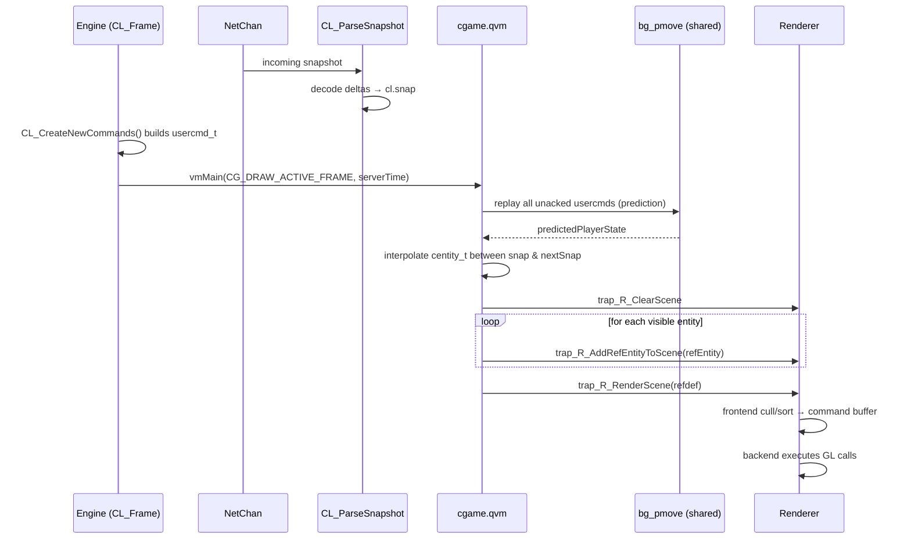
```mermaid
sequenceDiagram
    participant Engine as Engine (CL_Frame)
    participant Net as NetChan
    participant Parse as CL_ParseSnapshot
    participant CGame as cgame.qvm
    participant Pmove as bg_pmove (shared)
    participant R as Renderer

    Net->>Parse: incoming snapshot
    Parse->>Parse: decode deltas → cl.snap
    Engine->>Engine: CL_CreateNewCommands() builds usercmd_t
    Engine->>CGame: vmMain(CG_DRAW_ACTIVE_FRAME, serverTime)

    CGame->>Pmove: replay all unacked usercmds (prediction)
    Pmove-->>CGame: predictedPlayerState
    CGame->>CGame: interpolate centity_t between snap & nextSnap

    CGame->>R: trap_R_ClearScene
    loop for each visible entity
        CGame->>R: trap_R_AddRefEntityToScene(refEntity)
    end
    CGame->>R: trap_R_RenderScene(refdef)
    R->>R: frontend cull/sort → command buffer
    R->>R: backend executes GL calls
```

> **Why it matters.** This is the canonical "lockstep replication with prediction" pattern. The server is the single source of truth; the client extrapolates forward to hide latency. When the server's snapshot disagrees, the client *silently* corrects. Compare with: Google Docs OT/CRDTs (eventual consistency), database read-replicas (staleness window), distributed consensus (different problem entirely — Q3 has no consensus, just authority).

---

## 4. The VM sandbox — id's WebAssembly, ten years early

This is the architecturally most interesting piece. It's small enough to study in a week.

### 4.1 What problem does it solve?

In 1996 (Quake 1), mods shipped as native DLLs. Loading an untrusted DLL = arbitrary code execution. By Quake III (1999), id wanted mod portability *and* safety, so they built:

1. A custom toolchain: **lcc** (retargetable C compiler) + **q3asm** → produces `.qvm` bytecode.
2. A custom VM (`qcommon/vm*.c`) with **three execution modes** (`vmInterpret_t`):
   - `VMI_BYTECODE` — pure interpreter (slow, safe)
   - `VMI_COMPILED` — JIT to x86 (fast, safe — bounds-checked)
   - `VMI_NATIVE` — load `.so/.dll` (unsafe, dev only, disabled on pure servers)
3. A **closed syscall ABI**. The VM's data segment is a single power-of-two-sized buffer, and *every* pointer dereference is masked with `dataMask`. The VM literally cannot address engine memory.

### 4.2 Memory layout of a loaded VM

```
        VM data segment (power of 2, e.g. 16 MB)                Engine memory
   ┌────────────────────────────────────────────┐              ┌────────────┐
   │ .data │ .bss │     program stack   │ heap  │              │  engine    │
   └────────────────────────────────────────────┘              └────────────┘
        ^                                                            ^
        │ all pointers masked with dataMask                          │
        │ → cannot escape this buffer                                │
        └──── only path out: OP_SYSCALL(num, args...) ───────────────┘
                              │
                              ▼
                   engine's systemCall callback
                   (e.g. SV_GameSystemCalls)
```

### 4.3 The two-way ABI between engine and VM

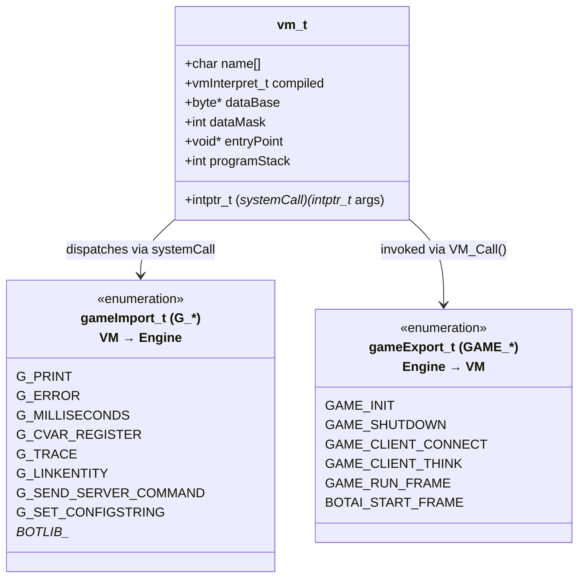
```mermaid
classDiagram
    class vm_t {
        +char name[]
        +vmInterpret_t compiled
        +byte* dataBase
        +int dataMask
        +intptr_t (*systemCall)(intptr_t* args)
        +void* entryPoint
        +int programStack
    }

    class GameImports["gameImport_t (G_*)<br/>VM → Engine"] {
        <<enumeration>>
        G_PRINT
        G_ERROR
        G_MILLISECONDS
        G_CVAR_REGISTER
        G_TRACE
        G_LINKENTITY
        G_SEND_SERVER_COMMAND
        G_SET_CONFIGSTRING
        BOTLIB_*
    }

    class GameExports["gameExport_t (GAME_*)<br/>Engine → VM"] {
        <<enumeration>>
        GAME_INIT
        GAME_SHUTDOWN
        GAME_CLIENT_CONNECT
        GAME_CLIENT_THINK
        GAME_RUN_FRAME
        BOTAI_START_FRAME
    }

    vm_t --> GameImports : dispatches via systemCall
    vm_t --> GameExports : invoked via VM_Call()
```

Defined in [code/game/g_public.h](code/game/g_public.h) (game), [code/cgame/cg_public.h](code/cgame/cg_public.h) (cgame), [code/ui/ui_public.h](code/ui/ui_public.h) (UI).

### 4.4 A single syscall round-trip

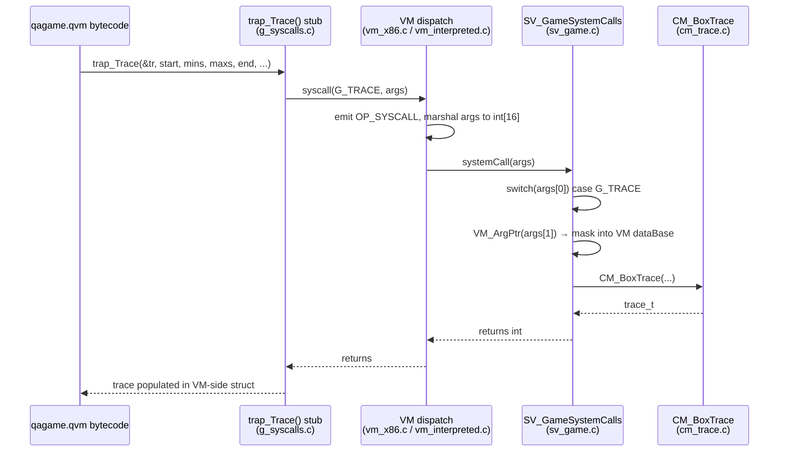
```mermaid
sequenceDiagram
    participant QAGame as qagame.qvm bytecode
    participant Stub as trap_Trace() stub<br/>(g_syscalls.c)
    participant VM as VM dispatch<br/>(vm_x86.c / vm_interpreted.c)
    participant Engine as SV_GameSystemCalls<br/>(sv_game.c)
    participant CM as CM_BoxTrace<br/>(cm_trace.c)

    QAGame->>Stub: trap_Trace(&tr, start, mins, maxs, end, ...)
    Stub->>VM: syscall(G_TRACE, args)
    VM->>VM: emit OP_SYSCALL, marshal args to int[16]
    VM->>Engine: systemCall(args)
    Engine->>Engine: switch(args[0]) case G_TRACE
    Engine->>Engine: VM_ArgPtr(args[1]) → mask into VM dataBase
    Engine->>CM: CM_BoxTrace(...)
    CM-->>Engine: trace_t
    Engine-->>VM: returns int
    VM-->>Stub: returns
    Stub-->>QAGame: trace populated in VM-side struct
```

> **Why it matters.** This is exactly the same pattern as a modern OS syscall (user-mode → trap → kernel → return), and exactly the same pattern as WebAssembly's import table. Notice `VM_ArgPtr` — the engine *cannot trust* a pointer from the VM; it must mask it back into the VM's data buffer. This is the iconic untrusted-pointer-check problem.

---

## 5. Layered entity model — three views of the same thing

Every networked object exists in three forms. Each layer drops information the next one doesn't need.

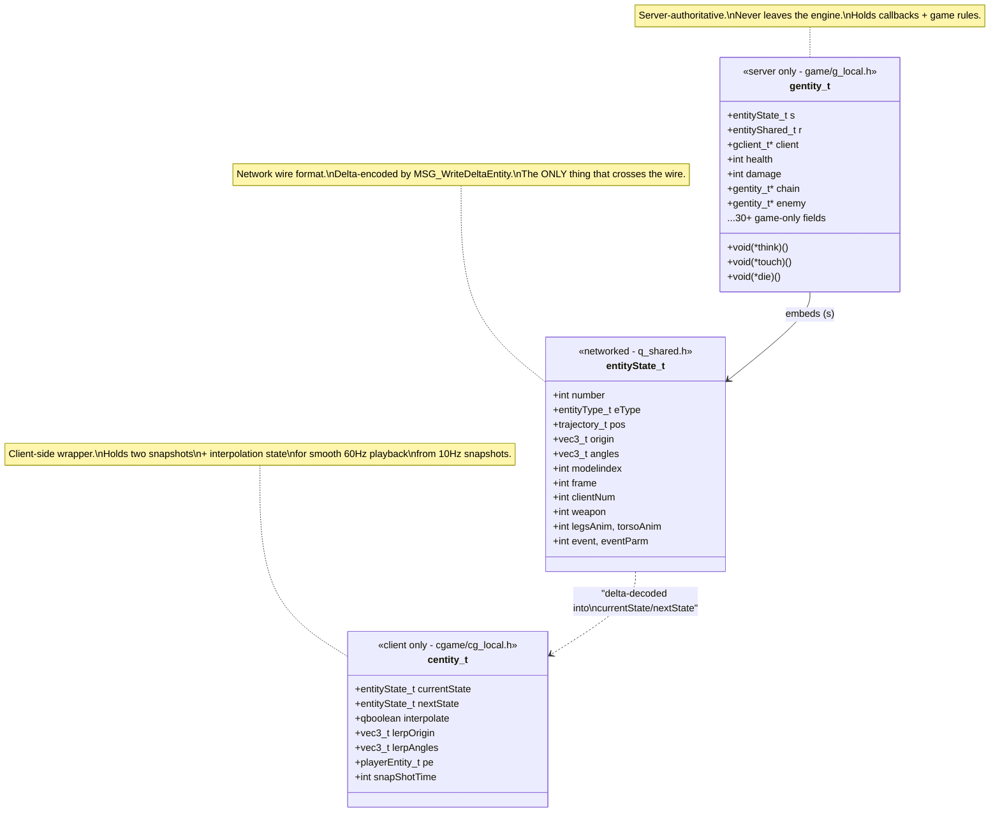
```mermaid
classDiagram
    class gentity_t {
        <<server only - game/g_local.h>>
        +entityState_t s
        +entityShared_t r
        +gclient_t* client
        +int health
        +int damage
        +void(*think)()
        +void(*touch)()
        +void(*die)()
        +gentity_t* chain
        +gentity_t* enemy
        ...30+ game-only fields
    }

    class entityState_t {
        <<networked - q_shared.h>>
        +int number
        +entityType_t eType
        +trajectory_t pos
        +vec3_t origin
        +vec3_t angles
        +int modelindex
        +int frame
        +int clientNum
        +int weapon
        +int legsAnim, torsoAnim
        +int event, eventParm
    }

    class centity_t {
        <<client only - cgame/cg_local.h>>
        +entityState_t currentState
        +entityState_t nextState
        +qboolean interpolate
        +vec3_t lerpOrigin
        +vec3_t lerpAngles
        +playerEntity_t pe
        +int snapShotTime
    }

    gentity_t --> entityState_t : embeds (s)
    entityState_t ..> centity_t : "delta-decoded into\ncurrentState/nextState"

    note for gentity_t "Server-authoritative.\nNever leaves the engine.\nHolds callbacks + game rules."
    note for entityState_t "Network wire format.\nDelta-encoded by MSG_WriteDeltaEntity.\nThe ONLY thing that crosses the wire."
    note for centity_t "Client-side wrapper.\nHolds two snapshots\n+ interpolation state\nfor smooth 60Hz playback\nfrom 10Hz snapshots."
```

> **Why it matters.** This is the *Don't Repeat Yourself*-violating-but-correct case study. Three structs, one logical entity. The duplication is *deliberate* — each layer has a different trust boundary, lifetime, and access pattern. Forcing them into one struct (as some 2000s-era engines did) couples network format to game logic and breaks both.

---

## 6. Shared `Pmove()` — the prediction trick

The single most copied design from this engine.

```
┌────────────────────────┐                ┌────────────────────────┐
│      SERVER            │                │       CLIENT           │
│                        │                │                        │
│  (qagame.qvm)          │   usercmd_t    │  (engine + cgame.qvm)  │
│  Pmove()  ←────────────│←───────────────│   Pmove()              │
│  AUTHORITATIVE         │                │   PREDICTIVE           │
│                        │                │                        │
│  writes playerState_t  │   snapshot     │  compares predicted    │
│  ────────────────────→ │ ──────────────→│  vs received → fixup   │
└────────────────────────┘                └────────────────────────┘
            ▲                                        ▲
            │                                        │
            │   SAME SOURCE CODE: bg_pmove.c is      │
            │   linked into BOTH qagame.qvm AND      │
            │   the engine (for cgame to call).      │
```

The shared "bg_" prefix in [code/game/bg_pmove.c](code/game/bg_pmove.c), [bg_misc.c](code/game/bg_misc.c), [bg_slidemove.c](code/game/bg_slidemove.c) literally stands for **b**oth-**g**ames (game + cgame). Compiling the same `Pmove()` into both VMs guarantees determinism: given the same `(playerState_t, usercmd_t)`, both produce the same next `playerState_t`. That's what makes the rollback-and-replay reconciliation in [code/cgame/cg_predict.c](code/cgame/cg_predict.c) work without snapping.

---

## 7. Networking — snapshot/delta protocol

### 7.1 The wire layout

```
┌─────────────────────────────────────────────────────────────────┐
│                      UDP PACKET (≤ 1400 B)                       │
├─────────────────────────────────────────────────────────────────┤
│ outgoingSequence (32b) │ qport (16b) │ [FRAGMENT_BIT, offset]?   │
├─────────────────────────────────────────────────────────────────┤
│                    huffman-compressed payload                    │
│  ┌──────────────────────────────────────────────────────────┐    │
│  │ serverCommand (reliable, ack'd by client)                │    │
│  │ snapshot:                                                │    │
│  │   ├── deltaNum (which past snap this is delta'd from)    │    │
│  │   ├── playerState_t  (delta-encoded)                     │    │
│  │   └── entityState_t[] (delta-encoded, terminated by -1)  │    │
│  └──────────────────────────────────────────────────────────┘    │
└─────────────────────────────────────────────────────────────────┘
```

### 7.2 Delta encoding of one struct

`MSG_WriteDeltaEntity` in [code/qcommon/msg.c](code/qcommon/msg.c):

```
for each field i in entityState_t (~25 fields):
    if from->field[i] == to->field[i]:
        write 1 bit: 0  (unchanged)
    else:
        write 1 bit: 1  (changed)
        write field-specific encoding (varint, half-precision, etc.)
stop early after the last changed field, write a sentinel.
```

A typical field-bit-budget for `entityState_t.origin` is 24 bits per axis (16.8 fixed-point); `eFlags` is 19 bits; `weapon` is 8 bits. The full struct is ~60 bytes uncompressed; a typical delta is **3–10 bytes**.

### 7.3 NetChan responsibilities (separation of concerns)

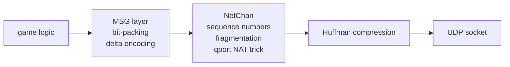
```mermaid
flowchart LR
    Game[game logic] --> MSG[MSG layer<br/>bit-packing<br/>delta encoding]
    MSG --> NetChan[NetChan<br/>sequence numbers<br/>fragmentation<br/>qport NAT trick]
    NetChan --> Huff[Huffman compression]
    Huff --> Sock[UDP socket]
```

`netchan_t` (in [code/qcommon/qcommon.h](code/qcommon/qcommon.h) ~line 180) holds:
- `outgoingSequence`, `incomingSequence` — monotonic packet counters (last 32 kept for delta windows; `PACKET_BACKUP = 32`).
- `fragmentSequence`, `fragmentBuffer[MAX_MSGLEN]` — for messages > 1400 B (e.g. initial gamestate).
- `qport` — random per-client port-substitute, makes Q3 traverse NAT before STUN existed.

> **Why it matters.** This protocol predates QUIC by 20 years and handles roughly the same problems: sequencing, fragmentation, lossy delta state, congestion-aware send rate. Modern game protocols (Source, Overwatch's "snapshot interpolation") are direct descendants. Compare-and-contrast assignment: how does this differ from gRPC streaming? (Hint: gRPC assumes TCP ordering; Q3 assumes UDP loss is normal.)

### 7.4 Connection handshake — the four-step OOB dance

Before a single snapshot flows, the client and server exchange four "out-of-band" datagrams. OOB packets begin with **four `0xFF` bytes** as the sequence number; this signals to [Netchan_Process](code/qcommon/net_chan.c#L304) that the packet is *not* part of a netchan and should be dispatched as ASCII text. See [SV_ConnectionlessPacket](code/server/sv_client.c#L502) and [CL_ConnectionlessPacket](code/client/cl_main.c#L1771).

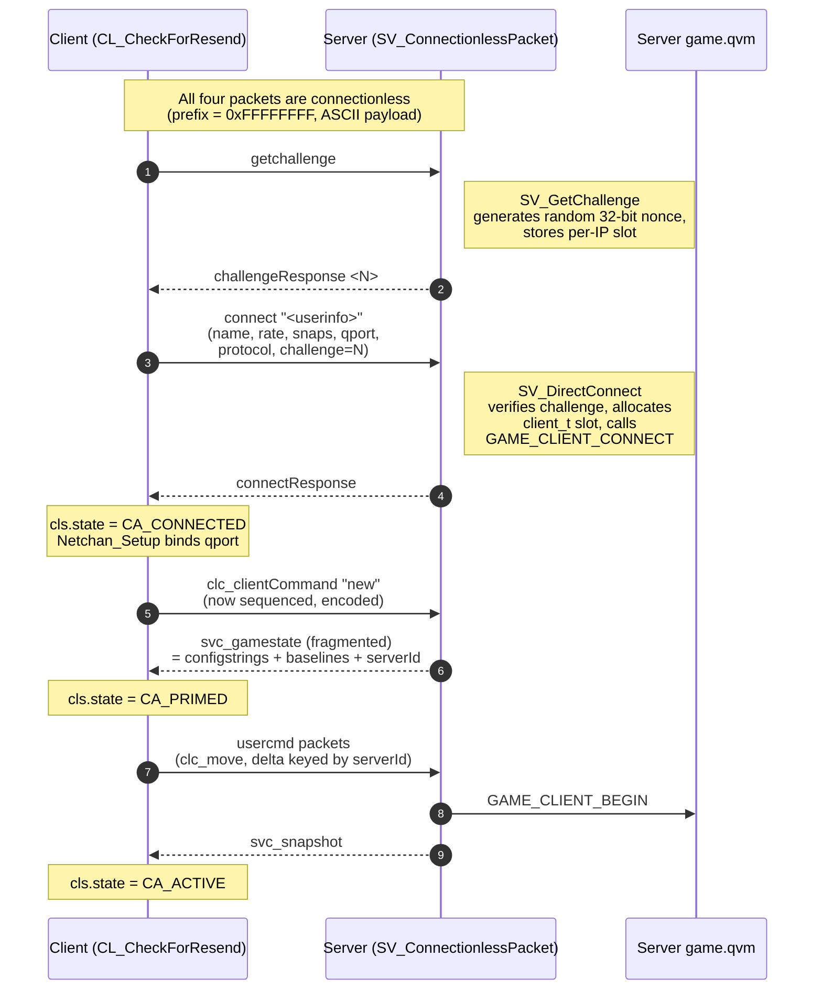
```mermaid
sequenceDiagram
    autonumber
    participant C as Client (CL_CheckForResend)
    participant S as Server (SV_ConnectionlessPacket)
    participant G as Server game.qvm

    Note over C,S: All four packets are connectionless<br/>(prefix = 0xFFFFFFFF, ASCII payload)

    C->>S: getchallenge
    Note right of S: SV_GetChallenge<br/>generates random 32-bit nonce,<br/>stores per-IP slot
    S-->>C: challengeResponse <N>
    C->>S: connect "<userinfo>"<br/>(name, rate, snaps, qport,<br/>protocol, challenge=N)
    Note right of S: SV_DirectConnect<br/>verifies challenge, allocates<br/>client_t slot, calls<br/>GAME_CLIENT_CONNECT
    S-->>C: connectResponse
    Note over C: cls.state = CA_CONNECTED<br/>Netchan_Setup binds qport
    C->>S: clc_clientCommand "new"<br/>(now sequenced, encoded)
    S-->>C: svc_gamestate (fragmented)<br/>= configstrings + baselines + serverId
    Note over C: cls.state = CA_PRIMED
    C->>S: usercmd packets<br/>(clc_move, delta keyed by serverId)
    S->>G: GAME_CLIENT_BEGIN
    S-->>C: svc_snapshot
    Note over C: cls.state = CA_ACTIVE
```

The challenge defends the server against IP-spoofed denial-of-service: an attacker who forges an IP cannot complete the round-trip, so cannot allocate a `client_t`. The challenge nonce becomes the **shared secret** that keys the XOR obfuscation in §7.7.

| State (`cls.state`) | Set by | Meaning |
|---|---|---|
| `CA_CONNECTING` | `connect` command in console | sending `getchallenge` packets every 3s |
| `CA_CHALLENGING` | challenge received | sending `connect <userinfo>` packets every 3s |
| `CA_CONNECTED` | `connectResponse` received | netchan open; requesting gamestate |
| `CA_LOADING` | gamestate received | loading map, registering media |
| `CA_PRIMED` | media loaded | sending usercmds, awaiting first snapshot |
| `CA_ACTIVE` | first snapshot parsed | normal play |

### 7.5 Wire layout — what's actually in the bytes

The original ASCII box in §7.1 simplifies one thing: the `serverId / messageAck / reliableAck` triple is *not* in the netchan header — it lives at the start of the **payload**, written by [CL_WritePacket](code/client/cl_input.c#L688). Here is the corrected, byte-accurate layout:

```
CLIENT → SERVER (per-frame "move" packet)
┌──────────────────────────────────────────────────────────────────────┐
│ [0..3]   outgoingSequence (32b LE)        ← Netchan, FRAGMENT_BIT msb │  netchan
│ [4..5]   qport (16b LE)                   ← survives NAT remap        │  header
├──────────────────────────────────────────────────────────────────────┤
│ [6..9]   serverId         (32b)  ─┐                                   │
│ [10..13] messageAck       (32b)   │ first 12 B XOR-keyed but unobfusc │  CL_Netchan_
│ [14..17] reliableAck      (32b)  ─┘ readable for ack tracking         │  Encode skips
├──────────────────────────────────────────────────────────────────────┤  these bits
│ <byte>   clc_clientCommand                              ◄─┐          │
│ <long>   command sequence#                                │ optional, │  obfuscated
│ <string> reliable command text (NUL-term)                 │ repeated  │  with a key
│            … more reliable commands …                   ◄─┘ until ack │  derived
├──────────────────────────────────────────────────────────────────────┤  from
│ <byte>   clc_move | clc_moveNoDelta                                  │  challenge ⊕
│ <byte>   N usercmds (1..MAX_PACKET_USERCMDS=32)                      │  serverId ⊕
│ <delta>  usercmd_t × N (delta-encoded, keyed by checksumFeed ⊕      │  messageAck
│                          messageAck ⊕ hash(last serverCommand))     │  ⊕ rolling
│ <byte>   clc_EOF                                                     │  serverCmd
└──────────────────────────────────────────────────────────────────────┘  bytes

SERVER → CLIENT
┌──────────────────────────────────────────────────────────────────────┐
│ [0..3]   outgoingSequence (32b LE, FRAGMENT_BIT msb)                  │  netchan
├──────────────────────────────────────────────────────────────────────┤
│ [4..7]   reliableAck (the last clc seq the server has executed)       │  obfuscation
├──────────────────────────────────────────────────────────────────────┤  key derived
│ <repeated reliable commands: svc_serverCommand <seq> <string>>        │  from
│ <byte> svc_snapshot                                                   │  challenge ⊕
│   <long> serverTime                                                   │  outgoing
│   <byte> deltaNum            (offset to the snapshot we delta from)   │  seq ⊕
│   <byte> snapFlags                                                    │  rolling
│   <byte> areabytes  +  <areabytes> areabits (PVS area mask)           │  clientCmd
│   <delta playerState_t>                                               │  bytes
│   <delta entityState_t list, terminated by entity# = MAX_GENTITIES-1> │
│ <optional svc_download chunk>                                         │
│ <byte> svc_EOF                                                        │
└──────────────────────────────────────────────────────────────────────┘
```

Notable details verified in the source:

- **`MAX_PACKETLEN = 1400`** ([net_chan.c:50](code/qcommon/net_chan.c#L50)): the absolute UDP datagram cap. Smaller than the 1500-byte Ethernet MTU because Q3 wants to survive a few layers of tunneling/headers.
- **`FRAGMENT_SIZE = MAX_PACKETLEN - 100 = 1300`** ([net_chan.c:52](code/qcommon/net_chan.c#L52)): payloads larger than this are split.
- **`PACKET_BACKUP = 32`** ([qcommon.h](code/qcommon/qcommon.h)): the depth of the per-side circular buffer of past snapshots (server keeps every client's last 32 frames; client keeps the server's last 32 deliveries).
- **`MAX_PACKET_USERCMDS = 32`**: the most usercmds that can ride in one client-to-server packet.

### 7.6 Fragmentation — why a stream protocol on top of UDP

The initial gamestate (configstrings, entity baselines for an entire map) is far larger than 1300 bytes. [Netchan_Transmit](code/qcommon/net_chan.c#L246) detects this and switches into fragmented mode: the high bit of the sequence number is set (`FRAGMENT_BIT`, `1<<31`), the payload includes a `(start, length)` pair, and one fragment is sent per server frame.

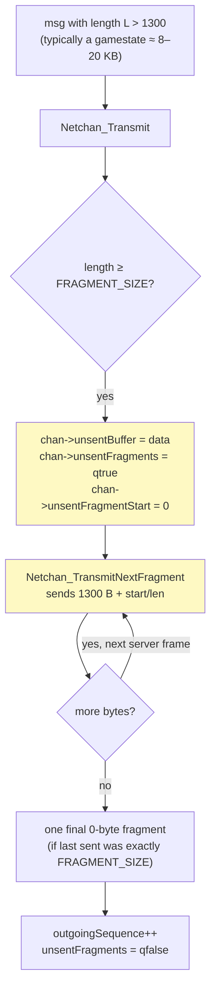
```mermaid
flowchart TB
    A["msg with length L > 1300<br/>(typically a gamestate ≈ 8–20 KB)"] --> B[Netchan_Transmit]
    B --> C{length ≥ FRAGMENT_SIZE?}
    C -->|yes| D[chan->unsentBuffer = data<br/>chan->unsentFragments = qtrue<br/>chan->unsentFragmentStart = 0]
    D --> E[Netchan_TransmitNextFragment<br/>sends 1300 B + start/len]
    E --> F{more bytes?}
    F -->|yes, next server frame| E
    F -->|no| G["one final 0-byte fragment<br/>(if last sent was exactly FRAGMENT_SIZE)"]
    G --> H[outgoingSequence++<br/>unsentFragments = qfalse]

    style D fill:#fef9c3
    style E fill:#fef9c3
```

On the receiving side ([Netchan_Process](code/qcommon/net_chan.c#L304)), fragments are reassembled into `chan->fragmentBuffer`. **One dropped fragment kills the whole message** — there is no NACK; the next attempt retransmits from the start. That's acceptable because gamestate fragmentation is a once-per-map event, not steady-state.

### 7.7 Reliable commands — the in-band TCP

Game-affecting text (`chat`, `cs <num> <newvalue>`, `tell`, server-side `print`) cannot tolerate loss the way snapshots can. Q3 layers a *reliable text channel* over the same UDP packets:

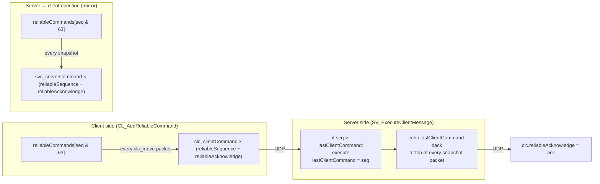
```mermaid
flowchart LR
    subgraph Client["Client side (CL_AddReliableCommand)"]
        CRel["reliableCommands[seq & 63]"] -->|"every clc_move packet"| CSend["clc_clientCommand × (reliableSequence − reliableAcknowledge)"]
    end

    subgraph Server["Server side (SV_ExecuteClientMessage)"]
        SRecv["if seq > lastClientCommand:<br/>execute<br/>lastClientCommand = seq"] --> SAckBack["echo lastClientCommand back<br/>at top of every snapshot packet"]
    end

    CSend -->|UDP| SRecv
    SAckBack -->|UDP| CAck["clc.reliableAcknowledge = ack"]

    subgraph ServerToClient["Server → client direction (mirror)"]
        SRel["reliableCommands[seq & 63]"] -->|"every snapshot"| SSend["svc_serverCommand × (reliableSequence − reliableAcknowledge)"]
    end
```

The crucial design choice: there is no exponential backoff, no retransmission timer. **Every outgoing packet carries every unacknowledged command.** This is bandwidth-cheap because commands are short strings, and it collapses the hard problem (when do I retransmit?) into the easy problem (just keep echoing). `MAX_RELIABLE_COMMANDS = 64` is the sliding-window depth; if a client's command queue overflows, the server drops it ([sv_client.c:1265](code/server/sv_client.c#L1265)).

The `reliableAcknowledge` round-trip also doubles as the **integrity baseline** for the XOR obfuscation key in §7.7 — both sides need to agree on the most recent command text before they can decode the next packet.

### 7.8 XOR obfuscation — the part jfedor's article forgets is in the public source

After the netchan header, the rest of every connected packet is XOR-stream-ciphered. The key is regenerated byte-by-byte from a small set of shared secrets:

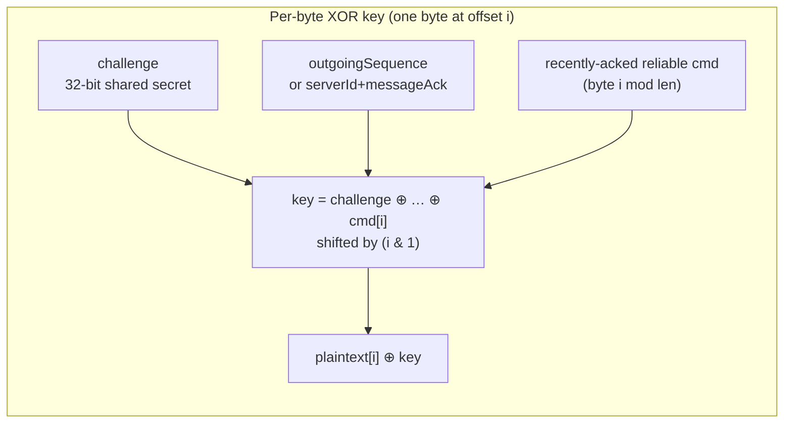
```mermaid
flowchart LR
    subgraph KeyMaterial["Per-byte XOR key (one byte at offset i)"]
        Ch[challenge<br/>32-bit shared secret] --> XOR
        SeqOrSrv[outgoingSequence<br/>or serverId+messageAck] --> XOR
        Cmd["recently-acked reliable cmd<br/>(byte i mod len)"] --> XOR
        XOR["key = challenge ⊕ … ⊕ cmd[i]<br/>shifted by (i &amp; 1)"] --> Out["plaintext[i] ⊕ key"]
    end
```

See [CL_Netchan_Encode/Decode](code/client/cl_net_chan.c#L38) and the symmetric [SV_Netchan_Encode/Decode](code/server/sv_net_chan.c#L36). Note three details that defeat naive cryptanalysis-as-a-service-bots:

1. **The first 12/4 bytes are skipped** (`CL_ENCODE_START`, `SV_ENCODE_START`) so the receiver can read the acks needed to *derive the key for the rest*.
2. **High-bit/`%` chars in the command are normalized to `'.'`**, so a byte distribution attack on the keystream can't lock onto specific commands.
3. **Both endpoints walk the keystream in lockstep with the rolling acknowledged-command index** — get out of sync once and every subsequent byte decrypts to garbage, the parser hits an invalid opcode, and the connection drops.

This is **obfuscation, not cryptography**. It exists to break trivial wallhack proxies and bandwidth-counter cheats that sniff packets, not to resist a determined attacker. The original `Netchan_ScramblePacket` in [net_chan.c:97-180](code/qcommon/net_chan.c#L97-L180) is `#if 0`-ed out — id replaced an unsequenced byte-permutation with this acknowledgement-keyed stream cipher because the latter forces an attacker to track game state to decode.

### 7.9 Static-tree Huffman — the part jfedor gets slightly wrong

The Q3 README says "adaptive Huffman", and the file is named [huffman.c](code/qcommon/huffman.c), but in the connected-packet path the tree never adapts. [MSG_initHuffman](code/qcommon/msg.c#L1709) builds the tree once at boot from a hand-tuned byte-frequency table (`msg_hData[]`, [msg.c:1450](code/qcommon/msg.c#L1450)) and from then on every packet uses the same static tree:

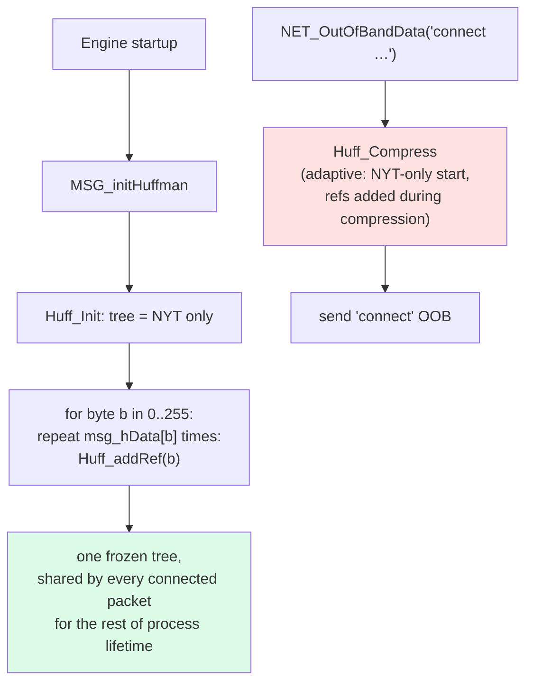
```mermaid
flowchart TB
    Boot["Engine startup"] --> Init[MSG_initHuffman]
    Init --> H1["Huff_Init: tree = NYT only"]
    H1 --> H2["for byte b in 0..255:<br/>repeat msg_hData[b] times:<br/>Huff_addRef(b)"]
    H2 --> H3["one frozen tree,<br/>shared by every connected packet<br/>for the rest of process lifetime"]

    Boot2["NET_OutOfBandData('connect …')"] --> Comp["Huff_Compress<br/>(adaptive: NYT-only start,<br/>refs added during compression)"]
    Comp --> Send[send 'connect' OOB]

    style H3 fill:#dcfce7
    style Comp fill:#fee2e2
```

So:

- **Connected packets use a fixed static-tree Huffman.** The tree is keyed by id's hand-tuned distribution of typical packet bytes — heavy weight on small ints, opcode IDs, and zeros from delta sentinels.
- **Only the `connect` OOB command uses true adaptive Huffman** ([NET_OutOfBandData](code/qcommon/net_chan.c#L673)), because that one carries the userinfo string and is compressed with `Huff_Compress` (which calls `Huff_addRef` after every symbol).
- **Bit-level interleaving:** [MSG_WriteBits](code/qcommon/msg.c#L107) sub-byte counts go directly into the bitstream raw; the byte-aligned remainder is Huffman-coded. This means a 19-bit `eFlags` field becomes 3 raw bits + 16 Huffman-coded bits.

> **Concept.** A fixed static Huffman is decoder-cheaper than adaptive (no tree-rebalance per symbol) and avoids any stream-recovery problem on packet loss. The cost is suboptimal compression on byte distributions that drift from id's reference corpus — fine in 1999, slightly silly today.

### 7.10 Bandwidth control — the snaps and rate cvars

Two client-controllable knobs throttle traffic:

| cvar | Default | Range | Side | Effect |
|---|---|---|---|---|
| `rate` | 3000 | 1000..90000 | client | bytes/sec the client can absorb; server uses it to time-slice outgoing snapshots ([SV_RateMsec](code/server/sv_snapshot.c#L527)) |
| `snaps` | 20 | 1..30 | client | max snapshots/sec the server should send ([SV_UserinfoChanged](code/server/sv_client.c#L1151)) |
| `cl_maxpackets` | 30 | 15..125 | client | upstream cap on usercmd packets/sec ([cl_input.c:652](code/client/cl_input.c#L652)) |
| `sv_maxRate` | 0 (off) | — | server | per-server cap that overrides per-client `rate` |
| `cl_packetdup` | 1 | 0..5 | client | each usercmd packet repeats the last N+1 frames of cmds, to survive packet loss |

`SV_RateMsec` does the budget accounting: every snapshot's size (plus a 48-byte IP/UDP/netchan estimate) is divided by `rate` to compute the next legal send time. If the client `rate`-budget hasn't refilled, the server **drops the snapshot entirely** and sets `SNAPFLAG_RATE_DELAYED` on the next one — the client's lagometer paints a yellow bar to indicate "the server muzzled us".

```
              messageSize + 48          1000
   delay_ms = ──────────────────  ×  ───────
                    rate              1
```

A 28.8 modem player runs `rate 2500` and receives ~5–10 snapshots/sec. A 56K modem player runs `rate 4000` and receives ~10–15. A LAN player overrides everything (`Sys_IsLANAddress` check in [SV_RateMsec](code/server/sv_snapshot.c#L572), `cl->rate = 99999`).

### 7.11 The lagometer — a debugging aid that became iconic

Bottom-right of the HUD, the lagometer paints two stacked graphs from rolling 128-sample buffers ([cg_draw.c:1590](code/cgame/cg_draw.c#L1590)):

```
    ┌────────────────────────────────────┐
    │ ▌ ▌ ▌ ▌▌▌▌▌▌▌▌▌▌▌▌▌▌▌▌▌▌▌▌▌▌▌▌▌▌▌▌ │ ← top: per-frame interp/extrap offset
    │ ▌▌▌▌▌▌▌▌▌▌▌▌▌▌▌▌▌▌▌▌▌▌▌▌▌▌▌▌▌▌▌▌▌▌ │   green = interpolating (good)
    │   ▒                                │   yellow = extrapolating (snapshot late)
    ├────────────────────────────────────┤
    │ ▌▌▌▌▌▌▌▌▌  ▌▌▌▌▌▌▌▌  ▌▌▌▌▌▌▌▌▌▌▌▌▌ │ ← bottom: per-snapshot ping
    │                                    │   gap = dropped snapshot
    │ R  R                               │   yellow R = SNAPFLAG_RATE_DELAYED
    └────────────────────────────────────┘
```

| Sample buffer | Filled by | What it records |
|---|---|---|
| `frameSamples[128]` | `CG_AddLagometerFrameInfo` (every render frame) | `cg.time − latestSnapshotTime` (positive = extrapolating into the future = bad) |
| `snapshotSamples[128]` | `CG_AddLagometerSnapshotInfo` (per snapshot) | `snap->ping` for received, `-1` for dropped |
| `snapshotFlags[128]` | same | `snap->snapFlags` (incl. `SNAPFLAG_RATE_DELAYED`) |

The top graph turning yellow is the symptom of: snapshot was dropped, client ran past the last good interpolation point, started extrapolating from `entityState_t.pos.trDelta` — and the further yellow extends, the more the player's guess about other players' positions is becoming a fiction.

### 7.12 The whole pipeline, end to end

```mermaid
sequenceDiagram
    autonumber
    participant Input as input poll<br/>(IN_Frame)
    participant CL as cl_input.c<br/>CL_CreateNewCommands
    participant CLNet as cl_net_chan.c<br/>CL_Netchan_Transmit
    participant Net as UDP socket
    participant SVNet as sv_net_chan.c<br/>SV_Netchan_Process
    participant SV as sv_client.c<br/>SV_ExecuteClientMessage
    participant Game as game.qvm<br/>GAME_CLIENT_THINK
    participant Snap as sv_snapshot.c<br/>SV_BuildClientSnapshot
    participant CLP as cl_parse.c<br/>CL_ParseSnapshot
    participant CG as cgame.qvm<br/>CG_DrawActiveFrame

    Input->>CL: kbd / mouse delta
    CL->>CL: cmds[cmdNumber++] = {fwd, side, up, angles, buttons}
    CL->>CLNet: serverId | msgAck | relAck | usercmds (delta, key=hash(challenge⊕msgAck⊕lastSrvCmd))
    CLNet->>CLNet: XOR-encode payload (skip first 12B)
    CLNet->>Net: Huffman-encode bits, prepend (seq|qport)
    Net-->>SVNet: UDP datagram
    SVNet->>SVNet: Netchan_Process → strip seq/qport
    SVNet->>SVNet: SV_Netchan_Decode → XOR-undo
    SVNet->>SV: msg w/ Bitstream cursor
    SV->>SV: ack reliables; replay each usercmd
    SV->>Game: GAME_CLIENT_THINK
    Game-->>SV: updated playerState_t, entityState_t[]
    Note over SV,Snap: --- 50ms later, server frame fires ---
    Snap->>Snap: pick visible entities (PVS + areamask)
    Snap->>Snap: delta vs client's last acked snapshot
    Snap->>SVNet: serverTime | lastframe | snapFlags | areabits | deltaPS | deltaEnts
    SVNet-->>Net: encode + transmit
    Net-->>CLP: UDP datagram
    CLP->>CLP: Netchan_Process; CL_Netchan_Decode
    CLP->>CLP: parse svc_snapshot
    CLP->>CG: cl.snap = newSnap; cl.newSnapshots = qtrue
    CG->>CG: replay unacked usercmds from server PS<br/>(prediction reconciliation)
    CG->>CG: BG_EvaluateTrajectory(other entities)<br/>at (cg.time − snapshotInterval)
    CG->>CG: render frame
```

Total latency budget on a 50ms-RTT link: ~50ms snapshot delay + ~50ms RTT + ~16ms render frame ≈ **120ms before player sees the consequence of a button press**. Prediction hides the first 50ms; interpolation hides the 50ms snapshot grain. The remaining 16-30ms render latency is the hard floor.

### 7.13 Lag compensation — what Unlagged fixes that base Q3 doesn't

Base Q3 has a famous flaw: **the player aims in the predicted present, but sees opponents in the interpolated past**. To hit a moving target you have to lead it by your ping plus the interpolation delay (≈ 100–150ms on the open internet), which is awful for hitscan weapons (railgun, shotgun, machinegun). Neil "haste" Toronto's *Unlagged* mod (2003) introduced the same fix that later shipped in Half-Life: server-side **time-shifted hit detection**.

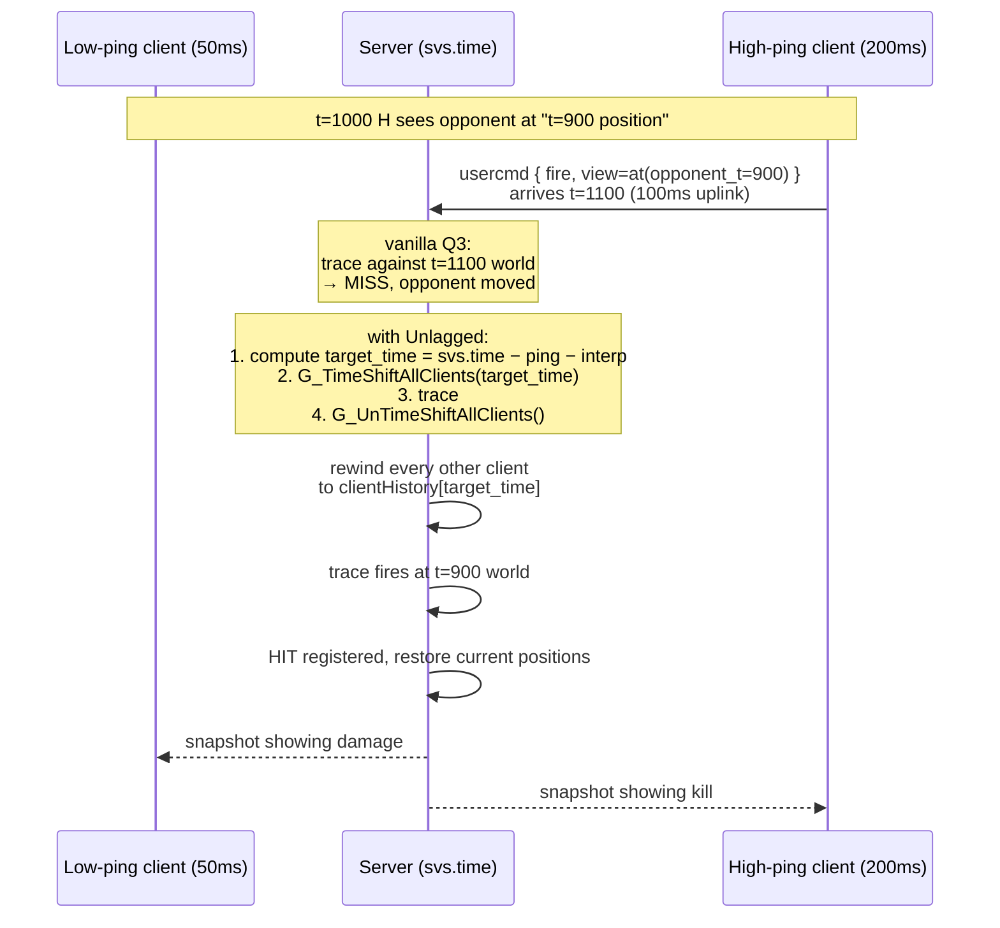
```mermaid
sequenceDiagram
    participant L as Low-ping client (50ms)
    participant S as Server (svs.time)
    participant H as High-ping client (200ms)

    Note over L,H: t=1000  H sees opponent at "t=900 position"
    H->>S: usercmd { fire, view=at(opponent_t=900) }<br/>arrives t=1100 (100ms uplink)

    Note over S: vanilla Q3:<br/>trace against t=1100 world<br/>→ MISS, opponent moved
    Note over S: with Unlagged:<br/>1. compute target_time = svs.time − ping − interp<br/>2. G_TimeShiftAllClients(target_time)<br/>3. trace<br/>4. G_UnTimeShiftAllClients()
    S->>S: rewind every other client<br/>to clientHistory[target_time]
    S->>S: trace fires at t=900 world
    S->>S: HIT registered, restore current positions
    S-->>L: snapshot showing damage
    S-->>H: snapshot showing kill
```

**The history buffer.** At the end of every server frame, [G_RunFrame](code/game/g_active.c) snapshots each client's `playerState_t.origin` (the *snapped* origin actually transmitted, not the floating-point one) into a per-client circular buffer indexed by server time. Buffer depth is sized for the worst expected ping — ~500 ms typical.

**The trace-time rewind.** When a client fires a hitscan weapon, before `trap_Trace` runs, the engine:

1. Computes `target_time = svs.time − cl_ping − cg_interp_delay − 50ms` (the 50ms covers Q3's snapshot grain).
2. Walks every *other* client and overwrites `r.currentOrigin` and BBox with the historical sample at `target_time`.
3. Runs the trace.
4. Restores the present positions immediately afterward.

The shooter is **not** rewound — their movement reaches the server before their fire command, so their server-side position already matches what they predicted locally.

| Topic | Vanilla Q3 | Unlagged |
|---|---|---|
| Hitscan registration | shooter must lead targets by ping + interp | "what you see is what you hit" |
| Server CPU per shot | one trace | one trace + 2 × N origin overwrites |
| Memory per client | none | ~500ms × 20Hz × `vec3_t` ≈ 120 bytes |
| Cross-client fairness | ping-fair (low ping wins) | shooter-fair (your latency only hurts you) |
| "Killed around the corner" | rare | possible — high-ping shooter hits low-ping target who ducked behind cover client-side |

The "killed around the corner" tradeoff is the design tax: lag compensation **trades visual consistency for shooter fairness**. id's own van Waveren paper (see §7.14) calls this "inherently flawed because it can cause events to happen that do not reflect the shared reality" — and that critique motivates the entire Doom 3 redesign.

A companion fix `cg_smoothClients`/`cg_smoothPlayers` stops *predicting* other players locally (which would otherwise invent ghost positions during snapshot gaps) — predict only your own player, interpolate everyone else. Without this, lag compensation can't reason about where the shooter "saw" the target, because the prediction would have moved the local view away from the snapshot ground truth.

### 7.14 Doom 3's redesign — id's own critique of Q3 netcode

In 2006 J.M.P. van Waveren published [The DOOM III Network Architecture](https://mrelusive.com/publications/papers/The-DOOM-III-Network-Architecture.pdf), which is the most direct primary source about what id thought was wrong with Q3's netcode by 2004. Five Q3 problems and Doom 3's fixes:

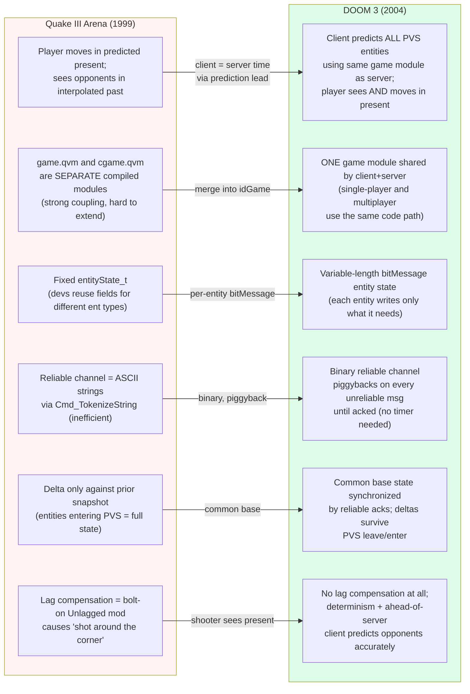
```mermaid
flowchart LR
    subgraph Q3["Quake III Arena (1999)"]
        Q3A["Player moves in predicted present;<br/>sees opponents in interpolated past"]
        Q3B["game.qvm and cgame.qvm<br/>are SEPARATE compiled modules<br/>(strong coupling, hard to extend)"]
        Q3C["Fixed entityState_t<br/>(devs reuse fields for different ent types)"]
        Q3D["Reliable channel = ASCII strings<br/>via Cmd_TokenizeString (inefficient)"]
        Q3E["Delta only against prior snapshot<br/>(entities entering PVS = full state)"]
        Q3F["Lag compensation = bolt-on Unlagged mod<br/>causes 'shot around the corner'"]
    end

    subgraph D3["DOOM 3 (2004)"]
        D3A["Client predicts ALL PVS entities<br/>using same game module as server;<br/>player sees AND moves in present"]
        D3B["ONE game module shared by client+server<br/>(single-player and multiplayer<br/>use the same code path)"]
        D3C["Variable-length bitMessage entity state<br/>(each entity writes only what it needs)"]
        D3D["Binary reliable channel<br/>piggybacks on every unreliable msg<br/>until acked (no timer needed)"]
        D3E["Common base state synchronized<br/>by reliable acks; deltas survive<br/>PVS leave/enter"]
        D3F["No lag compensation at all;<br/>determinism + ahead-of-server<br/>client predicts opponents accurately"]
    end

    Q3A -->|"client = server time<br/>via prediction lead"| D3A
    Q3B -->|"merge into idGame"| D3B
    Q3C -->|"per-entity bitMessage"| D3C
    Q3D -->|"binary, piggyback"| D3D
    Q3E -->|"common base"| D3E
    Q3F -->|"shooter sees present"| D3F

    style Q3 fill:#fef2f2
    style D3 fill:#dcfce7
```

The critical idea is **client prediction lead**:

```
                                    server time → ─────────────────────►
                                         │
   (Q3)         past   ◄─────  client view ─────►   predicted present
                                                        ▲
                                          "shoots from here, sees from past"
                                                                    
   (D3)                                      server  ◄─── client lead time ─── client
                                                ▲                                ▲
                              snapshot baseline                     player input
                                                                  (sent ahead of time
                                                                   via prediction)
```

In Doom 3 the client time runs *ahead of* the server time by approximately `ping + jitter_margin`. The client sends its usercmds with future-frame numbers; the server queues them and applies them when its own simulation reaches that frame. The server tells the client back, in every snapshot, *how far ahead the cmds arrived* — the client adjusts its lead to keep that number small but positive. If a packet is late, the server duplicates the previous cmd (and reports the duplicate count, which the client uses to widen its lead).

| Aspect | Q3 (1999) | Doom 3 (2004) |
|---|---|---|
| Client time relative to server | runs in past + predicts forward | runs ahead of server |
| What client predicts | own player only (via Pmove) | all PVS entities |
| Module split | engine `game` + `cgame` (two QVMs) | one `idGame` shared | 
| Tick rate | 20 Hz simulation | 60 Hz simulation |
| Snapshot rate | 10-30 Hz | 10-20 Hz |
| Entity state schema | fixed `entityState_t`, 50 fields | variable `idBitMsg` per entity |
| Delta baseline | last acked snapshot | "common base" replicated by reliable ack |
| Reliable channel | ASCII text, parsed by Cmd_TokenizeString | binary, piggybacked on every unreliable |
| PVS membership encoding | implicit (entities just appear in list) | explicit 4096-bit string, delta'd in 32-bit chunks |
| Shared simulation code | `bg_pmove.c` only | entire game logic |
| Lag compensation | external (Unlagged mod) | none — relies on client-lead prediction |
| Compression | static-tree Huffman | bit-pack + delta + 3-bit zero-RLE |

> **Concept.** The same architectural pattern can be specialized in two opposite directions. Q3 puts the client *behind* the server and uses interpolation + prediction to hide the gap. Doom 3 puts the client *ahead* of the server and uses dead-reckoning prediction of all entities to fill the gap. Both are valid; both ship; both inspire decades of follow-on engines. The Source engine (Half-Life 2, CS:S) descends mostly from the Q3 model with lag compensation. The Quake Live tickrate-128 servers descend from the same. Modern competitive shooters (Valorant, Overwatch 2) have re-converged on the Q3 lag-compensation lineage — because given fast enough networks, "shooter fairness" beats "perfect simulation".

---

## 8. Filesystem — virtualized over zip

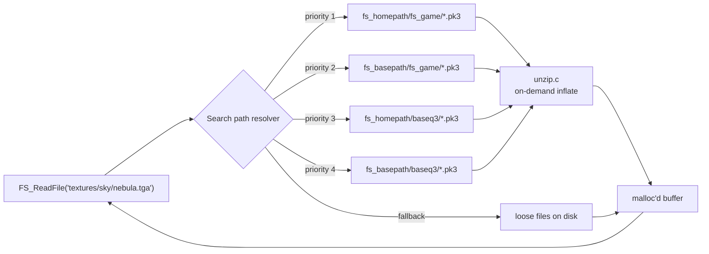
```mermaid
flowchart LR
    Game["FS_ReadFile('textures/sky/nebula.tga')"] --> FS{Search path resolver}
    FS -->|priority 1| H1[fs_homepath/fs_game/*.pk3]
    FS -->|priority 2| H2[fs_basepath/fs_game/*.pk3]
    FS -->|priority 3| H3[fs_homepath/baseq3/*.pk3]
    FS -->|priority 4| H4[fs_basepath/baseq3/*.pk3]
    FS -->|fallback| Disk[loose files on disk]
    H1 --> Unzip[unzip.c<br/>on-demand inflate]
    H2 --> Unzip
    H3 --> Unzip
    H4 --> Unzip
    Unzip --> Buf[malloc'd buffer]
    Disk --> Buf
    Buf --> Game
```

A `.pk3` is **literally a renamed `.zip`**. [code/qcommon/files.c](code/qcommon/files.c) indexes every file in every pak at startup; lookups are hash-table O(1). The "highest priority pak wins" rule is what enables mod loading without recompilation — drop a `zz_mymod.pk3` into `baseq3/` and it overrides core assets alphabetically.

---

## 9. Collision model — BSP + brushes + patches

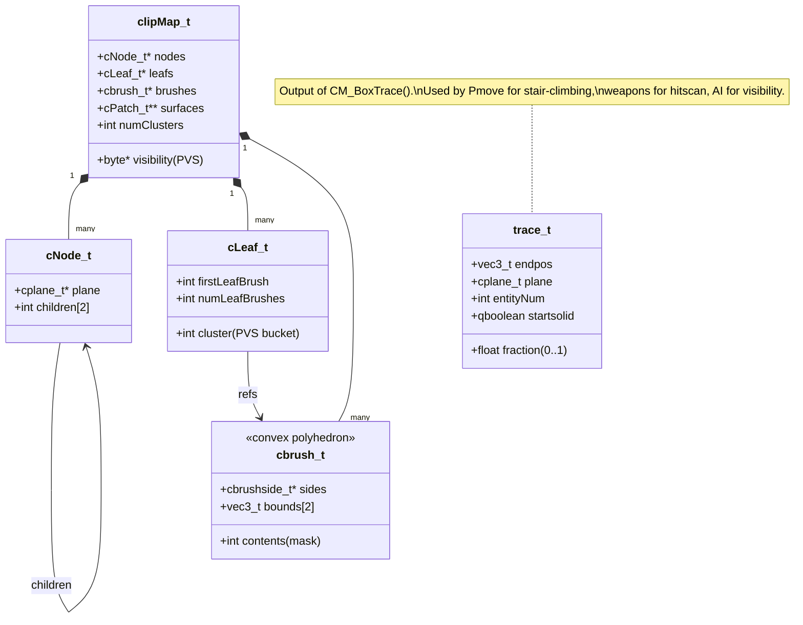
```mermaid
classDiagram
    class clipMap_t {
        +cNode_t* nodes
        +cLeaf_t* leafs
        +cbrush_t* brushes
        +cPatch_t** surfaces
        +byte* visibility (PVS)
        +int numClusters
    }
    class cNode_t {
        +cplane_t* plane
        +int children[2]
    }
    class cLeaf_t {
        +int cluster (PVS bucket)
        +int firstLeafBrush
        +int numLeafBrushes
    }
    class cbrush_t {
        <<convex polyhedron>>
        +cbrushside_t* sides
        +vec3_t bounds[2]
        +int contents (mask)
    }
    class trace_t {
        +float fraction (0..1)
        +vec3_t endpos
        +cplane_t plane
        +int entityNum
        +qboolean startsolid
    }

    clipMap_t "1" *-- "many" cNode_t
    clipMap_t "1" *-- "many" cLeaf_t
    clipMap_t "1" *-- "many" cbrush_t
    cNode_t --> cNode_t : children
    cLeaf_t --> cbrush_t : refs
    note for trace_t "Output of CM_BoxTrace().\nUsed by Pmove for stair-climbing,\nweapons for hitscan, AI for visibility."
```

A `CM_BoxTrace(start, end, mins, maxs, mask)` recursively descends the BSP, clipping the swept AABB against each split plane, then the convex `cbrush_t`s in candidate leaves. Cost: roughly O(log n) for the tree + O(brushes-in-leaf) for the clip.

---

## 10. Renderer — frontend/backend split with command buffer

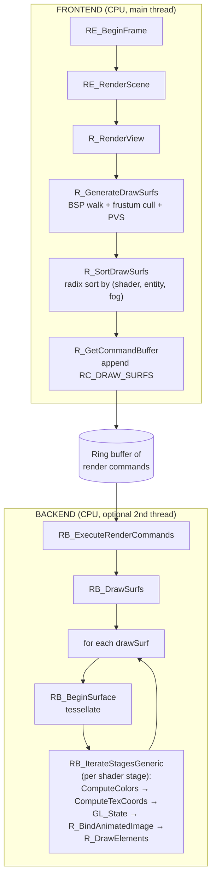
```mermaid
flowchart TB
    subgraph FE["FRONTEND (CPU, main thread)"]
      Begin[RE_BeginFrame] --> Scene[RE_RenderScene]
      Scene --> View[R_RenderView]
      View --> Cull[R_GenerateDrawSurfs<br/>BSP walk + frustum cull + PVS]
      Cull --> Sort["R_SortDrawSurfs<br/>radix sort by (shader, entity, fog)"]
      Sort --> Cmd[R_GetCommandBuffer<br/>append RC_DRAW_SURFS]
    end

    Cmd --> Ring[(Ring buffer of<br/>render commands)]

    subgraph BE["BACKEND (CPU, optional 2nd thread)"]
      Exec[RB_ExecuteRenderCommands] --> DS[RB_DrawSurfs]
      DS --> Loop["for each drawSurf"]
      Loop --> Begin2[RB_BeginSurface<br/>tessellate]
      Begin2 --> Stages["RB_IterateStagesGeneric<br/>(per shader stage):<br/>ComputeColors → ComputeTexCoords →<br/>GL_State → R_BindAnimatedImage →<br/>R_DrawElements"]
      Stages --> Loop
    end

    Ring --> Exec
```

### 10.1 The shader system — Q3's most-copied idea

A `shader_t` is a parsed text script with up to **8 `shaderStage_t` passes**. Each stage = one texture binding + one GL state set + one draw of the same geometry. Multipass per surface gives multitextured materials on the GeForce 256 era hardware.

Example shader stage (conceptually):
```
textures/base_wall/concrete {
  surfaceparm metalsteps
  { map textures/base_wall/concrete.tga ; rgbGen identity }      // pass 1
  { map $lightmap                       ; blendfunc filter }     // pass 2
  { map textures/effects/scroll.tga     ; tcMod scroll 0.1 0   } // pass 3 (scrolling overlay)
}
```

The key data classes:

```mermaid
classDiagram
    class shader_t {
        +char name[]
        +int sortedIndex
        +shaderStage_t* stages[MAX_SHADER_STAGES]
        +cullType_t cullType
        +deformStage_t deforms[]
    }
    class shaderStage_t {
        +textureBundle_t bundle[2]
        +waveForm_t rgbWave
        +colorGen_t rgbGen
        +alphaGen_t alphaGen
        +texModInfo_t* texMods
        +unsigned stateBits  (GL state)
    }
    class textureBundle_t {
        +image_t* image[]
        +int numImageAnimations
        +tcGen_t tcGen
    }
    class image_t {
        +char imgName[]
        +int width, height
        +GLuint texnum
    }
    shader_t "1" *-- "1..8" shaderStage_t
    shaderStage_t "1" *-- "1..2" textureBundle_t
    textureBundle_t "1" --> "1..*" image_t
```

> **Why it matters.** This is the canonical example of **data-driven design** in graphics. Before Q3, materials were C structs in code; after Q3, every engine (Unreal, Source, modern Unity ShaderGraph) has a data-driven shader system. The pattern is *interpreter over a small DSL embedded in your main engine*.

### 10.2 Per-frame call tree

```
RE_BeginFrame()              // tr_cmds.c:305 — queue RC_SET_COLOR/RC_DRAW_BUFFER
RE_RenderScene(refdef)       // tr_scene.c:288
  └── R_RenderView()          // tr_main.c:1454
        ├── R_SetupFrustum()
        ├── R_GenerateDrawSurfs()
        │     ├── R_AddWorldSurfaces()      // tr_world.c:645
        │     │     ├── R_MarkLeaves()       // PVS lookup
        │     │     └── R_RecursiveWorldNode() // BSP walk + frustum cull
        │     └── R_AddEntitySurfaces()     // models, sprites
        └── R_SortDrawSurfs()                // bucket by shader
RE_EndFrame()                 // tr_cmds.c:420
  └── R_IssueRenderCommands(qtrue)
        └── RB_ExecuteRenderCommands()      // tr_backend.c:1075
              ├── RB_DrawSurfs()
              │     └── per drawSurf:
              │           ├── RB_BeginSurface()
              │           ├── rb_surfaceTable[type]()  // RB_SurfaceMesh / Face / Grid
              │           └── RB_StageIteratorGeneric()
              │                 └── RB_IterateStagesGeneric()
              │                       └── R_DrawElements()
              └── RB_SwapBuffers()
```

---

## 11. Bot AI — a two-layer architecture

```mermaid
flowchart TB
    subgraph engine["ENGINE-SIDE (botlib/, native C)"]
      AAS["AAS — Area Awareness System<br/>precomputed nav mesh"]
      EA["EA — Elementary Actions<br/>EA_Move, EA_Attack, EA_View"]
      Chat["Chat templates<br/>l_precomp DSL"]
      Goal["Goal manager"]
      Weap["Weapon characteristics"]
    end

    subgraph qvm["GAME-SIDE (game/ai_*.c, in qagame.qvm)"]
      Main["ai_main<br/>per-bot state, frame driver"]
      DMNet["ai_dmnet<br/>behavior network<br/>(state machine of nodes)"]
      DMQ3["ai_dmq3<br/>Q3 tactics: weapon choice,<br/>item priority, pickup"]
      Team["ai_team / ai_cmd / ai_vcmd<br/>CTF roles, voice cmds"]
      ChatTop["ai_chat<br/>taunt selection"]
    end

    Main --> DMNet
    DMNet --> DMQ3
    DMQ3 --> Team
    DMQ3 --> ChatTop

    DMNet -. trap_BotMoveToGoal .-> EA
    DMQ3 -. trap_BotChooseWeapon .-> Weap
    DMNet -. AAS_AreaTravelTime .-> AAS
    ChatTop -. trap_BotGetChatMessage .-> Chat
    DMNet -. trap_BotSetGoal .-> Goal
```

### 11.1 AAS in one picture

```
WORLD (BSP)                    AAS PRECOMPUTE                ROUTING (RUNTIME)
┌─────────────┐              ┌────────────────────┐         ┌─────────────────┐
│ brushes     │  q3map -bsp  │ Convex AREAS       │         │ AAS_PointAreaNum│
│ entities    │ ───────────→ │ grouped into       │ ──────→ │ AAS_AreaTravel- │
│ patches     │  bspc -aas   │ CLUSTERS via       │  O(1)   │ TimeToGoalArea  │
│             │              │ PORTALS;           │  lookup │ AAS_PredictRoute│
│             │              │ REACHABILITIES     │         │                 │
│             │              │ encode jump/swim/  │         │ All Dijkstra    │
│             │              │ rocket-jump etc.   │         │ already done    │
│             │              │ with travel times  │         │ offline.        │
└─────────────┘              └────────────────────┘         └─────────────────┘
```

> **Why it matters.** AAS is a precomputed *nav-mesh* — Recast/Detour and Unreal's NavMesh are direct descendants. Q3 was first-of-class in 1999 because it explicitly modeled *traversal modes* (rocket-jumping, water swimming) as edge attributes. Compare with classical A* over a uniform grid (Warcraft III): AAS is to A* as a routing table is to packet flooding.

### 11.2 Bot decision state machine (`ai_dmnet.c`)

```mermaid
stateDiagram-v2
    [*] --> SeekLTG : spawn
    SeekLTG : Seek Long-Term Goal\n(item, flag, base)
    SeekNBG : Seek Nearby Goal\n(opportunistic pickup)
    BattleFight : Battle Fight
    BattleChase : Battle Chase
    BattleRetreat : Battle Retreat
    BattleNBG : Battle Nearby Goal\n(grab item mid-fight)
    Respawn : Respawn

    SeekLTG --> SeekNBG : "small detour worth it"
    SeekLTG --> BattleFight : "enemy spotted"
    SeekNBG --> SeekLTG : "goal reached"
    BattleFight --> BattleChase : "enemy lost LOS"
    BattleFight --> BattleRetreat : "low health"
    BattleChase --> BattleFight : "enemy reacquired"
    BattleChase --> SeekLTG : "lost too long"
    BattleRetreat --> SeekLTG : "safe"
    BattleFight --> BattleNBG : "weapon nearby"
    BattleNBG --> BattleFight
    SeekLTG --> Respawn : "died"
    BattleFight --> Respawn : "died"
    Respawn --> SeekLTG
```

---

## 12. Build pipeline — how source becomes a `.qvm`

```mermaid
flowchart LR
    src[".c source<br/>game/cgame/ui"] --> lcc["lcc<br/>retargetable C compiler"]
    lcc --> asm["q3 assembly (.asm)"]
    asm --> q3asm["q3asm<br/>assembler"]
    q3asm --> qvm[".qvm bytecode"]
    qvm --> pak["packaged in pak0.pk3"]

    src2[".map text"] --> q3map["q3map<br/>BSP compiler"]
    q3map --> bsp[".bsp + AAS"]
    bsp --> pak

    art["textures, models,<br/>sounds, shaders"] --> pak
```

So `lcc` (yes, *that* lcc — Hanson & Fraser's textbook compiler from "A Retargetable C Compiler") is targeted at a custom register-machine ISA, then assembled into `.qvm`. id literally shipped a complete C toolchain inside the game.

---

## 13. Threads & concurrency

For something so influential, Q3 is mostly **single-threaded**:

| Thread | Responsibility | Source |
|---|---|---|
| Main | Everything: net, sim, prediction, frontend | `Com_Frame` loop |
| Render backend (optional) | OpenGL submission only | `r_smp` cvar; `RB_ExecuteRenderCommands` |
| Sound mixer (platform-specific) | DMA buffer fill | `snd_dma.c`, called from OS audio callback |

Cross-thread synchronization is two **double-buffered command queues** (`backEndData[2]`) flipped at end-of-frame. No mutexes in the hot path. This is a useful counterexample for "more threads = more performance" — the design is fast *because* it minimizes cross-thread state.

---

## 14. Trust boundaries — a security view

```mermaid
flowchart TB
    Untrusted["UNTRUSTED INPUTS"] --> Net[network packets]
    Untrusted --> Pak[downloaded .pk3]
    Untrusted --> Map[.bsp / .aas]
    Untrusted --> Cfg[.cfg console scripts]

    Net --> NetChan["NetChan: sequence checks,<br/>fragment bounds checks"]
    Pak --> Unzip["unzip.c: decompression bounds<br/>(this is the source of many CVEs!)"]
    Map --> CMLoad["CM_LoadMap: lump bounds check"]
    Cfg --> Cmd["Cmd: arg-count limit, length limit"]

    NetChan --> MSG[MSG layer]
    Unzip --> FS[FS layer]
    CMLoad --> CM[CM layer]
    Cmd --> Cvar[Cvar registry]

    MSG --> VM
    FS --> VM
    CM --> VM
    Cvar --> VM["VM sandbox<br/>(dataMask on every pointer)"]

    VM --> Engine[Engine internals]
```

> **Why it matters.** The Q3 codebase has an excellent recorded CVE history — `unzip.c`, `CM_LoadMap` lump parsing, and oversized `MSG_ReadString` were all real exploit vectors. This is a perfect course study: where does input validation live, where *should* it live, what happens when sandboxes leak.

---

## 15. Recommended reading order through the source

If you're studying this codebase from scratch, walk it in this order:

1. **`code/qcommon/qcommon.h`** — read the header end-to-end. It's the engine's "table of contents."
2. **`code/qcommon/common.c`** — `Com_Init`, `Com_Frame`. The whole engine is one big loop.
3. **`code/game/g_public.h`** + **`code/server/sv_game.c`** — the syscall ABI, both sides.
4. **`code/qcommon/vm.c`** + **`code/qcommon/vm_interpreted.c`** — read the interpreter (skip x86 JIT first time).
5. **`code/game/bg_pmove.c`** — the most-copied 2,000 lines in game-engine history.
6. **`code/server/sv_snapshot.c`** + **`code/qcommon/msg.c`** — the snapshot/delta protocol.
7. **`code/cgame/cg_predict.c`** + **`code/cgame/cg_snapshot.c`** — the client side of prediction.
8. **`code/renderer/tr_main.c`** + **`code/renderer/tr_backend.c`** + **`code/renderer/tr_shade.c`** — the renderer.
9. **`code/qcommon/cm_trace.c`** — the BSP trace; small but dense.
10. **`code/botlib/be_aas_*.c`** + **`code/game/ai_dmnet.c`** — the AI.

---

## 16. Suggested study questions (graduate level)

1. **Sandboxing.** Compare and contrast the QVM with WebAssembly. What invariants does each rely on for memory safety? Where does each draw the trust boundary?
2. **Determinism.** Why must `Pmove()` be deterministic for prediction to work? Identify three sources of nondeterminism a careless port could introduce (floating-point mode, RNG seeding, undefined pointer arithmetic).
3. **Delta encoding.** `MSG_WriteDeltaEntity` writes a "last-changed-field index." Why is that more efficient than a full per-field bitmask? When does it become *less* efficient?
4. **Interpolation vs. extrapolation.** `cgame` interpolates between two received snapshots, introducing one-snapshot-period (≈100 ms) of *visual* latency. Why is this preferred over extrapolating forward?
5. **Renderer split.** What problem does the frontend/backend command-buffer split solve that a simple "draw immediately" architecture can't? Where do modern engines (Vulkan command buffers, Metal command queues) land on the same axis?
6. **AAS vs. A\*.** Quake III precomputes routes; modern games often run A* online over a NavMesh. Under what conditions does each win?
7. **Single binary, two roles.** The same `quake3` executable is both client and dedicated server (`+set dedicated 2`). What does this design buy you and what does it cost?
8. **Data-driven shaders.** Read three real `.shader` files from `pak0.pk3`. Identify a stage that *cannot* be expressed in this DSL. How would you extend the DSL? What's the engine cost?
9. **Fault domains.** A buggy mod crashes inside the qagame VM. What's the blast radius? What if it crashes inside the renderer DLL? What if it crashes in `qcommon`?
10. **Cache coherency.** `entityState_t` is small and hot; `gentity_t` is large and cold. Does this layout deliberately optimize for cache behavior on the snapshot path? Measure with `perf` and report.

---

## Appendix A — Directory map (one-line summaries)

| Directory | Role | Key files |
|---|---|---|
| `code/qcommon/` | Engine core: VM, FS, net, collision, bit-packing | `common.c`, `vm.c`, `msg.c`, `net_chan.c`, `cm_trace.c`, `files.c` |
| `code/server/` | Authoritative simulation; resolves qagame syscalls | `sv_main.c`, `sv_snapshot.c`, `sv_game.c`, `sv_client.c` |
| `code/client/` | Local presentation: input, sound, parsing, snapshot, cinematic, console | `cl_main.c`, `cl_parse.c`, `cl_input.c`, `cl_cgame.c`, `snd_dma.c` |
| `code/renderer/` | OpenGL renderer (loaded as DLL) | `tr_main.c`, `tr_backend.c`, `tr_shader.c`, `tr_shade.c`, `tr_world.c` |
| `code/game/` | qagame VM source: rules, physics, AI bridges, shared `bg_*` | `g_main.c`, `bg_pmove.c`, `g_active.c`, `g_combat.c`, `ai_*.c` |
| `code/cgame/` | cgame VM source: HUD, prediction, interpolation, effects | `cg_main.c`, `cg_predict.c`, `cg_snapshot.c`, `cg_view.c`, `cg_weapons.c` |
| `code/ui/`, `code/q3_ui/` | Menu VM source | `ui_main.c`, `ui_atoms.c` |
| `code/botlib/` | Generic bot infrastructure linked into engine | `be_aas_*.c`, `be_ai_*.c`, `be_ea.c`, `l_*.c` |
| `code/unix/`, `code/win32/`, `code/macosx/` | Platform layers (entry point, OS calls, GL context) | `unix_main.c`, `win_main.c` |
| `code/null/` | "Headless" stubs for dedicated server build | `null_client.c`, `null_input.c`, `null_snddma.c` |
| `code/jpeg-6/` | Vendored libjpeg | (3rd-party) |
| `code/splines/` | C++ spline library (cinematics) | (mostly unused at runtime) |
| `lcc/` | Retargetable C compiler that targets the QVM | (build tool) |
| `q3asm/` | Assembler: q3 .asm → .qvm | (build tool) |
| `q3map/` | .map → .bsp compiler | (build tool) |
| `q3radiant/` | Map editor (Win32) | (tool) |

---

## Appendix B — Glossary

| Term | Meaning |
|---|---|
| **QVM** | Quake Virtual Machine — id's custom bytecode VM, sandbox for mod code |
| **Snapshot** | Server's view of the world sent to a client; delta-encoded against a prior snapshot |
| **usercmd_t** | One frame of player input (buttons + mouse delta + movement axes) |
| **playerState_t** | Per-client authoritative state: position, velocity, health, weapon, anim |
| **entityState_t** | Networked per-entity state — the wire format |
| **gentity_t** | Server-only full game-entity struct (think/touch/die callbacks) |
| **centity_t** | Client-only wrapper around two entityStates for interpolation |
| **PVS** | Potentially Visible Set — precomputed leaf-to-leaf visibility for culling |
| **BSP** | Binary Space Partition — tree of split planes encoding the world geometry |
| **AAS** | Area Awareness System — precomputed nav mesh for bots |
| **Pmove** | Player Move — the deterministic physics step shared between server and client |
| **NetChan** | Sequencing/fragmentation layer above UDP |
| **refexport_t/refimport_t** | The vtable boundary between engine and renderer DLL |
| **drawSurf_t** | A unit of rendering work: (shader, surface, entity, fog) |
| **shader_t** | A parsed material script with up to 8 stages |
| **pk3** | A renamed zip; the unit of asset packaging |
