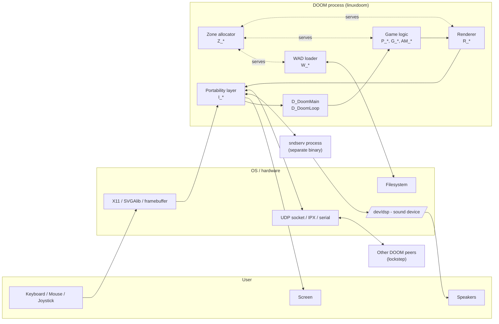

# DOOM 1.10 Source Code — Graduate Software-Engineering Study Material

> Target reader: graduate CS / SWE student studying real-world systems software.
>
> Source under study: id Software's Linux DOOM 1.10 (released 1997-12-23, GPLv2).
> The codebase here lives in [linuxdoom-1.10/](../linuxdoom-1.10/), with the
> standalone sound server in [sndserv/](../sndserv/) and the (DOS-only) network
> drivers in [ipx/](../ipx/) and [sersrc/](../sersrc/).

This package is a guided tour of the architecture. It is organised so you can
read it linearly the first time, then come back and zoom into any one diagram
later. Diagrams are written in **Mermaid** so any modern markdown viewer
(VS Code, GitHub, Obsidian) renders them inline.

## Reading order

1. [01 — Module map and naming convention](01_module_map.md)
2. [02 — Main loop and tic model](02_game_loop.md)
3. [03 — Input pipeline and ticcmds](03_input_and_ticcmd.md)
4. [04 — Memory: the Zone allocator](04_zone_allocator.md)
5. [05 — Asset pipeline: WAD lumps](05_wad_pipeline.md)
6. [06 — Map runtime data model (BSP geometry)](06_map_data_model.md)
7. [07 — Actors: mobj_t and the thinker system](07_mobj_thinker.md)
8. [08 — Player state](08_player.md)
9. [09 — Renderer (BSP traversal pipeline)](09_renderer.md)
10. [10 — Sound subsystem and external sndserv](10_sound.md)
11. [11 — Networking: lockstep peer-to-peer](11_networking.md)
12. [12 — Game state machine](12_game_state.md)
13. [13 — Portability layer: the i_* abstraction](13_portability.md)
14. [14 — Cross-cutting concerns and lessons](14_lessons.md)
15. [15 — Suggested study exercises](15_exercises.md)

## What makes DOOM worth studying

DOOM is studied at graduate level not because the code is pristine — it is not —
but because it is a working, shipped, performance-critical real-time system
small enough to read end-to-end in a week. Specifically, you will see:

- **Deterministic lockstep simulation** decoupled from rendering and from
  wall-clock. The game is parameterised by a fixed-rate `tic` (35 Hz). All
  state changes are functions of input plus prior state, which is what lets
  demos record/replay and lets multiplayer be peer-to-peer with no
  authoritative server. See [02](02_game_loop.md), [11](11_networking.md).
- **A custom memory allocator** with purgeable cache tags. Pre-1995 PCs had
  little RAM and no virtual memory worth using; DOOM ships its own zone-style
  arena that lets short-lived assets be evicted on demand. See
  [04](04_zone_allocator.md).
- **Binary Space Partitioning** used both as a precomputed visibility/render
  structure and (informally) as a spatial index. See [09](09_renderer.md).
- **A function-pointer-driven actor system** ("thinkers") that is essentially
  an object system implemented in C, similar in spirit to the message-passing
  loop in Smalltalk or Objective-C. See [07](07_mobj_thinker.md).
- **A clean portability seam** — every system call goes through an `I_*`
  function declared in [linuxdoom-1.10/i_system.h](../linuxdoom-1.10/i_system.h),
  [i_video.h](../linuxdoom-1.10/i_video.h), [i_sound.h](../linuxdoom-1.10/i_sound.h),
  [i_net.h](../linuxdoom-1.10/i_net.h). See [13](13_portability.md).
- **A WAD asset format** that is a primitive but effective virtual filesystem,
  decoupling code releases from content releases (the foundation of mod
  culture). See [05](05_wad_pipeline.md).

Carmack's own retrospective (in [README.TXT](../README.TXT)) is required reading;
he flags what he would do differently with hindsight. The most important
self-criticism — using polar-coordinate clipping rather than reusing the BSP
for collision and line-of-sight — is the kind of architectural lesson worth
internalising.

## High-level system context



The dashed edges from the **Zone allocator** are deliberate: virtually every
heap allocation in the game goes through `Z_Malloc`, not `malloc` directly.
The only escape hatches are early bootstrap (`D_AddFile`'s argv handling) and
the platform layer's allocation of the zone itself via `I_ZoneBase`.

## Codebase scale at a glance

```
linuxdoom-1.10/   ~54k LOC of portable C and headers
ipx/              DOS IPX network driver  (separate executable, ~1.5k LOC)
sersrc/           DOS serial/modem driver (separate executable, ~2k LOC)
sndserv/          Linux sound server      (separate process,    ~1k LOC)
```

Reference: file inventory in [linuxdoom-1.10/FILES](../linuxdoom-1.10/FILES).
