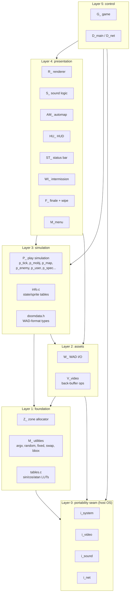
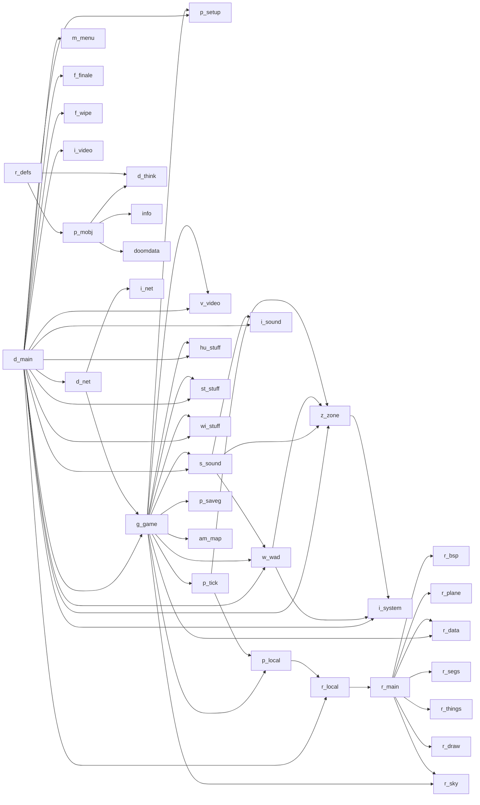

# 01 — Module map and naming convention

DOOM is written in C89 with no namespaces. Modularity is enforced by a strict
**filename-and-symbol prefix convention**: every translation unit's public
symbols share the prefix derived from its filename. This is a low-tech but
extraordinarily effective module discipline — `grep '^P_'` immediately gives
you the public surface of the play-simulation subsystem.

## Subsystem prefix legend

| Prefix | Meaning                       | Representative files                                   |
|--------|-------------------------------|--------------------------------------------------------|
| `D_`   | DOOM core / glue              | [d_main.c](../linuxdoom-1.10/d_main.c), [d_net.c](../linuxdoom-1.10/d_net.c) |
| `G_`   | **G**ame logic / control flow | [g_game.c](../linuxdoom-1.10/g_game.c)                 |
| `P_`   | **P**lay simulation (world)   | [p_tick.c](../linuxdoom-1.10/p_tick.c), [p_mobj.c](../linuxdoom-1.10/p_mobj.c), [p_map.c](../linuxdoom-1.10/p_map.c), [p_enemy.c](../linuxdoom-1.10/p_enemy.c), [p_user.c](../linuxdoom-1.10/p_user.c), `p_*` |
| `R_`   | **R**enderer / refresh        | [r_main.c](../linuxdoom-1.10/r_main.c), [r_bsp.c](../linuxdoom-1.10/r_bsp.c), [r_segs.c](../linuxdoom-1.10/r_segs.c), [r_plane.c](../linuxdoom-1.10/r_plane.c), [r_things.c](../linuxdoom-1.10/r_things.c), [r_data.c](../linuxdoom-1.10/r_data.c), [r_draw.c](../linuxdoom-1.10/r_draw.c) |
| `W_`   | **W**AD I/O                   | [w_wad.c](../linuxdoom-1.10/w_wad.c)                   |
| `Z_`   | **Z**one memory allocator     | [z_zone.c](../linuxdoom-1.10/z_zone.c)                 |
| `S_`   | **S**ound (game side)         | [s_sound.c](../linuxdoom-1.10/s_sound.c)               |
| `I_`   | **I**nterface to host OS      | [i_system.c](../linuxdoom-1.10/i_system.c), [i_video.c](../linuxdoom-1.10/i_video.c), [i_sound.c](../linuxdoom-1.10/i_sound.c), [i_net.c](../linuxdoom-1.10/i_net.c) |
| `M_`   | **M**iscellaneous utilities   | [m_argv.c](../linuxdoom-1.10/m_argv.c), [m_random.c](../linuxdoom-1.10/m_random.c), [m_fixed.c](../linuxdoom-1.10/m_fixed.c), [m_swap.c](../linuxdoom-1.10/m_swap.c), [m_menu.c](../linuxdoom-1.10/m_menu.c), [m_misc.c](../linuxdoom-1.10/m_misc.c), [m_bbox.c](../linuxdoom-1.10/m_bbox.c), [m_cheat.c](../linuxdoom-1.10/m_cheat.c) |
| `V_`   | **V**ideo: 320x200 software framebuffer ops | [v_video.c](../linuxdoom-1.10/v_video.c) |
| `HU_`  | **H**eads-**U**p messaging    | [hu_stuff.c](../linuxdoom-1.10/hu_stuff.c), [hu_lib.c](../linuxdoom-1.10/hu_lib.c) |
| `ST_`  | **St**atus bar                | [st_stuff.c](../linuxdoom-1.10/st_stuff.c), [st_lib.c](../linuxdoom-1.10/st_lib.c) |
| `WI_`  | **W**rap-up / **I**ntermission| [wi_stuff.c](../linuxdoom-1.10/wi_stuff.c)             |
| `F_`   | **F**inales / wipes           | [f_finale.c](../linuxdoom-1.10/f_finale.c), [f_wipe.c](../linuxdoom-1.10/f_wipe.c) |
| `AM_`  | **A**uto**m**ap               | [am_map.c](../linuxdoom-1.10/am_map.c)                 |

## Layered component diagram

This is the *intended* dependency direction. Lower layers do not (and must not)
include upper-layer headers. There are a few historical inversions; learning to
spot them is itself a good exercise.

## Module dependency graph (real, simplified)

The diagram above is the layering *as designed*. The diagram below is closer to
*as built*: solid arrows are direct `#include`s observed in the headers, and
some couplings cross what should be layer boundaries.

## Why this matters as a design pattern

A C codebase of this size with *no* build system enforcement of module
boundaries can still feel small and navigable because:

1. **Prefixes are the namespace.** `R_RenderPlayerView`, not
   `Renderer::renderPlayerView`. You can find every public function in a
   subsystem with `grep`.
2. **Public/private split is by file, not by keyword.** Each subsystem has a
   `*_local.h` (private) and `*.h` (public). Compare
   [r_local.h](../linuxdoom-1.10/r_local.h) (renderer internals — sprites,
   visplanes, drawsegs) with [r_main.h](../linuxdoom-1.10/r_main.h) (the API
   the rest of the game calls).
3. **One initialiser per module.** Each subsystem exposes a single `X_Init()`
   called once from `D_DoomMain` in a fixed order. See lines
   1011–1113 of [d_main.c](../linuxdoom-1.10/d_main.c#L1011-L1113):
   `V_Init → M_LoadDefaults → Z_Init → W_InitMultipleFiles → M_Init →
   R_Init → P_Init → I_Init → D_CheckNetGame → S_Init → HU_Init → ST_Init`.
   That ordering encodes the dependency DAG.
4. **One ticker per module.** Each *active* subsystem exposes an `X_Ticker()`
   invoked from `G_Ticker`. This is the discrete-event scheduler equivalent
   of a fixed task list.

Modern equivalents: Go packages, Rust crates, ES modules. The *separation of
public surface from implementation* is the durable idea — the syntax is
incidental.
