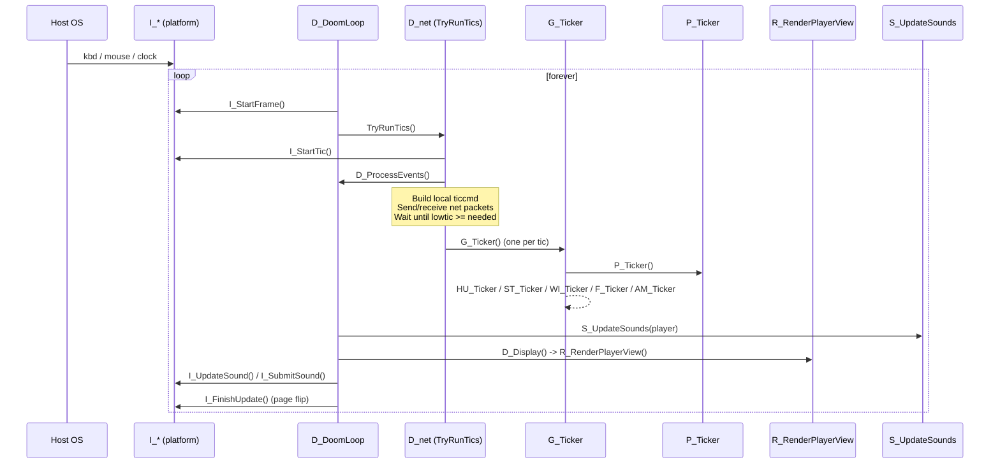
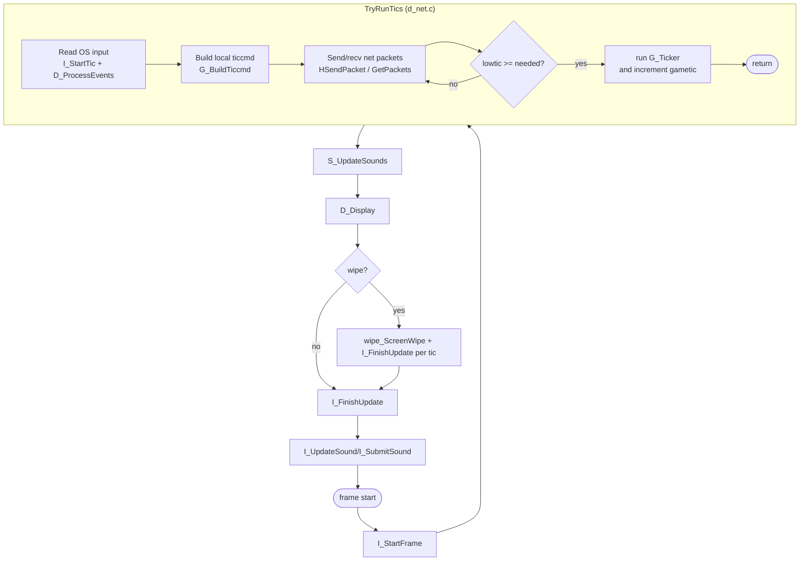
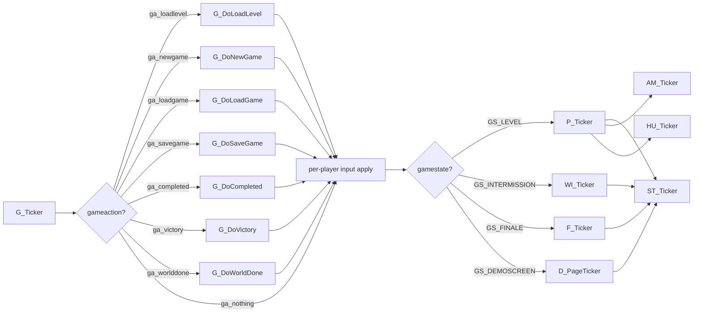

# 02 — Main loop and tic model

The architectural choice that defines DOOM's behaviour more than any other is
the **fixed-tic simulation, decoupled from rendering**. Every fact in this
document — multiplayer, demos, save games, save-game determinism, deterministic
AI — is downstream of this one decision.

Source: [d_main.c:354 D_DoomLoop](../linuxdoom-1.10/d_main.c#L354-L407),
[d_net.c TryRunTics](../linuxdoom-1.10/d_net.c#L632-L767),
[g_game.c G_Ticker](../linuxdoom-1.10/g_game.c).

## The two clocks

| Clock     | Variable                | Rate                | Source                                 |
|-----------|-------------------------|---------------------|----------------------------------------|
| Real time | `I_GetTime()` returns tics since process start | 35 Hz nominal    | [i_system.c](../linuxdoom-1.10/i_system.c) (uses `gettimeofday`) |
| Game time | `gametic`               | 35 Hz, but not wall-clock | [g_game.c](../linuxdoom-1.10/g_game.c) |
| Build time| `maketic`               | local input rate    | [d_net.c](../linuxdoom-1.10/d_net.c)   |

**Invariant**: the game cannot advance `gametic` past the lowest peer's
`maketic`. This is what makes it a lockstep simulation. See
[`TryRunTics`](../linuxdoom-1.10/d_net.c#L632) — it spins on
`while (lowtic < gametic/ticdup + counts)`.

`TICRATE = 35` is hard-coded in [doomdef.h:122](../linuxdoom-1.10/doomdef.h#L122).
The rendering loop runs as fast as the host machine allows.

## The main loop, end to end



Note that `TryRunTics` may run **zero, one or many** `G_Ticker` calls per
display frame. If the renderer is slow, ticks queue up and the next call
catches the simulation back up; if the renderer is fast, the loop spins in
`I_GetTime` waiting for tic-rate to elapse. This is the classic *"fixed
timestep, variable render"* pattern, formalised much later by Glenn Fiedler
(2004) but already shipped here.

## Activity diagram of one display frame



## What runs inside G_Ticker

`G_Ticker` is the single dispatcher for everything the simulation does in one
tic. It is *not* a thread or a coroutine — it is a sequential pipeline.
Source: [g_game.c](../linuxdoom-1.10/g_game.c) (function `G_Ticker`).



Inside `P_Ticker` ([p_tick.c:130](../linuxdoom-1.10/p_tick.c#L130-L158)) the
order is again strict and worth memorising:

```c
for (i=0; i<MAXPLAYERS; i++)
    if (playeringame[i])
        P_PlayerThink(&players[i]);   // apply ticcmds

P_RunThinkers();        // every actor's brain
P_UpdateSpecials();     // animated textures, scrollers
P_RespawnSpecials();    // respawn pickups in deathmatch
leveltime++;
```

## The "single-tic" debug mode

[d_main.c:374-386](../linuxdoom-1.10/d_main.c#L374-L386) shows a useful
shortcut for instrumentation:

```c
if (singletics) {
    I_StartTic();
    D_ProcessEvents();
    G_BuildTiccmd(...);
    M_Ticker();
    G_Ticker();
    gametic++; maketic++;
}
```

This bypasses `TryRunTics` entirely and runs **exactly one tic per render
frame**, decoupling the simulation from real time. It is invaluable for
profiling because it removes both the busy-wait and the catch-up multi-tic
case.

## Lessons

- The *only* place where the game checks the clock is inside `TryRunTics`.
  Everything downstream is in tic-space.
- Code that reads from RNG (`M_Random` in [m_random.c](../linuxdoom-1.10/m_random.c))
  is therefore fully deterministic given a seed and a sequence of `ticcmd_t`s.
  This is what allows DOOM demos (LMP files) to replay perfectly: the demo file
  is just a stream of `ticcmd_t`s.
- A modern variant — for instance Quake 3's `cl_predict` and snapshot system,
  or rollback netcode in fighting games — preserves *exactly* this property.

> Read next: [03 — Input pipeline and ticcmds](03_input_and_ticcmd.md).
