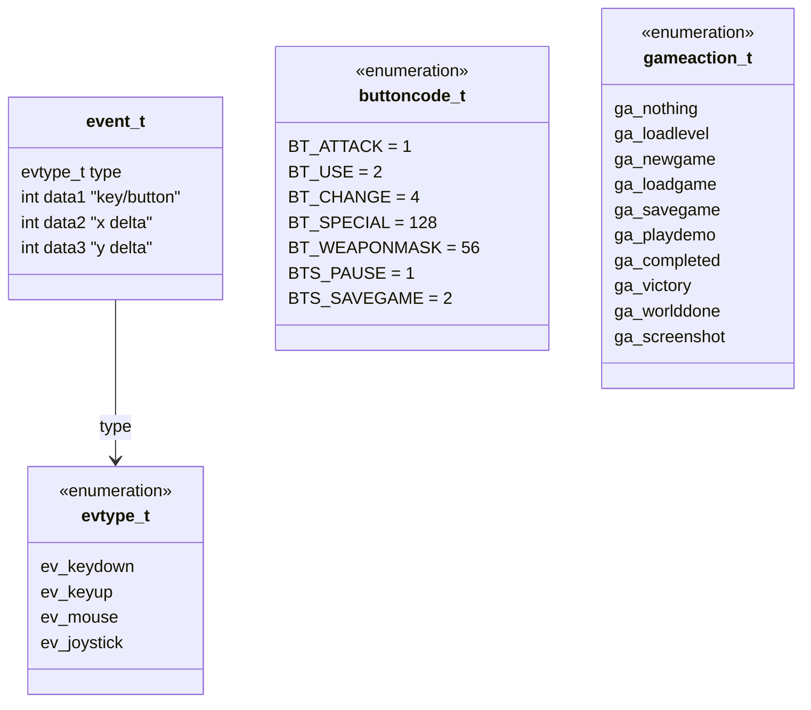
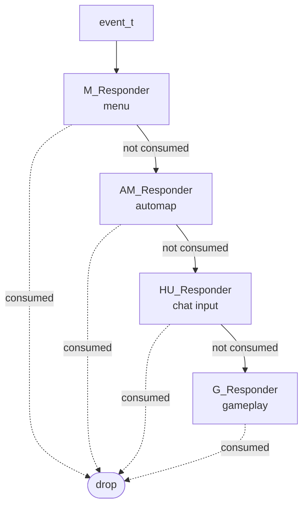

# 03 — Input pipeline and ticcmds

The unit of "what the player did during one tic" is the `ticcmd_t`. It is the
boundary between everything asynchronous (key events, network packets, demo
files) and the deterministic simulation. Internalising what a `ticcmd_t` is
unlocks both the multiplayer design and the replay system.

## ticcmd_t — the input quantum

Source: [d_ticcmd.h:36-44](../linuxdoom-1.10/d_ticcmd.h#L36-L44).

```c
typedef struct {
    char    forwardmove;   // *2048 to get fixed-point movement
    char    sidemove;      // *2048
    short   angleturn;     // <<16 for angle delta
    short   consistancy;   // sanity check across peers
    byte    chatchar;
    byte    buttons;       // BT_ATTACK | BT_USE | BT_CHANGE | weapon
} ticcmd_t;
```

Eight bytes. That is the entire "input bandwidth" per player per tic. At 35
tics/s × 4 players that is ~1.1 KB/s of input traffic in a four-way deathmatch
— a constraint that mattered on 14.4 kbps modems in 1993.

The `consistancy` field is critical: peers compare it after each tic and
disconnect if simulations have diverged. This is the desync detector and an
elegant example of an end-to-end check rather than a per-message integrity
check.

## End-to-end input flow

```mermaid
sequenceDiagram
    participant HW as Keyboard / Mouse / Joystick
    participant IV as I_video / I_system (per-platform)
    participant Q as event_t ring buffer
    participant Resp as M_Responder / G_Responder / AM_Responder / HU_Responder / ST_Responder / F_Responder / WI_Responder
    participant State as gamekeydown[] / mousex,mousey
    participant Build as G_BuildTiccmd
    participant Net as D_net
    participant Sim as G_Ticker -> P_PlayerThink

    HW->>IV: kbd / mouse / joy events
    IV->>Q: D_PostEvent(event_t)
    Q->>Resp: D_ProcessEvents() drains queue
    Resp-->>Resp: tried in priority order;<br/>first to return true consumes
    Resp->>State: update key/mouse arrays
    Build->>State: read accumulated state
    Build->>Build: produce ticcmd_t<br/>(checked against MAXPLMOVE)
    Build->>Net: localcmds[maketic % BACKUPTICS]
    Net->>Net: send packet to peers,<br/>await peer ticcmds
    Net->>Sim: netcmds[player][gametic % BACKUPTICS]
    Sim->>Sim: apply forwardmove,<br/>sidemove, angleturn,<br/>buttons (fire, use, weapon)
```

Key references:
- Event queue: [d_main.c D_PostEvent / D_ProcessEvents](../linuxdoom-1.10/d_main.c#L141-L177).
- Responder chain registered in [d_main.c D_ProcessEvents](../linuxdoom-1.10/d_main.c#L161-L177) — `M_Responder` first, then `G_Responder`.
- Ticcmd construction in [g_game.c G_BuildTiccmd](../linuxdoom-1.10/g_game.c) (around line 250+).
- Application in [p_user.c P_PlayerThink → P_MovePlayer](../linuxdoom-1.10/p_user.c).

## Event-type taxonomy



Source: [d_event.h](../linuxdoom-1.10/d_event.h).

## The responder chain (Chain-of-Responsibility, in C)

Each subsystem that wants raw events exposes an `X_Responder(event_t*)` that
returns `true` if it consumed the event. The order is significant — it
encodes *who has focus*. Roughly, top of stack = first to ask:



`G_Responder` is where the per-tic state arrays (`gamekeydown[]`, `mousex`,
`mousey`, `joyxmove`, `joyymove`, `mousebuttons[]`, `joybuttons[]`) are
updated.

## Ring buffers everywhere

DOOM uses **fixed-size circular buffers** in two layered stages:

| Buffer                | Size            | Purpose                                           |
|-----------------------|-----------------|---------------------------------------------------|
| `events[MAXEVENTS]`   | 64              | OS-event queue ([d_event.h:108](../linuxdoom-1.10/d_event.h#L108)) |
| `localcmds[BACKUPTICS]`     | 12              | Local ticcmd history ([d_net.c](../linuxdoom-1.10/d_net.c)) |
| `netcmds[MAXPLAYERS][BACKUPTICS]` | 4×12      | Per-peer ticcmd history (covers retransmit)        |

`BACKUPTICS = 12` is tuned to be larger than the expected peer-lag window so a
late peer can still be caught up by retransmission rather than session
re-sync.

The advance in `D_PostEvent` is the classic single-producer/single-consumer
ring with a power-of-two mask:

```c
events[eventhead] = *ev;
eventhead = (++eventhead) & (MAXEVENTS-1);
```

(Note: that is technically undefined behaviour because `++eventhead` and
`eventhead =` modify and use `eventhead` without a sequence point. Modern
compilers warn. Hold the thought; it is one of the bugs you might be asked to
identify in a graduate code review exercise.)

## Demos as ticcmd streams

A `.lmp` demo file is essentially:

```
header (skill/episode/map/playernumber)
ticcmd_t[]   ; one per player per tic, in order
```

When a demo plays, `G_ReadDemoTiccmd` substitutes for `G_BuildTiccmd` and
delivers the recorded sequence into `netcmds[]`. From `P_Ticker`'s point of
view nothing is different. This is the cleanest expression of the
input-as-data principle: there is exactly one place that knows where ticcmds
come from.

## Why this matters

- **Network model and replay model are the same code.** A demo is a degenerate
  netgame with one peer.
- **Input compression is trivial.** 8 bytes/tic gives you per-tic granularity
  for input recording without bespoke serialisation.
- **All async I/O is funneled to one drain.** OS events, mouse, joystick — they
  all land in one ring buffer that one function (`D_ProcessEvents`) drains at
  one phase of the tic. There is no concurrency story to debug because there
  is no concurrency.

> Read next: [04 — Memory: the Zone allocator](04_zone_allocator.md).
