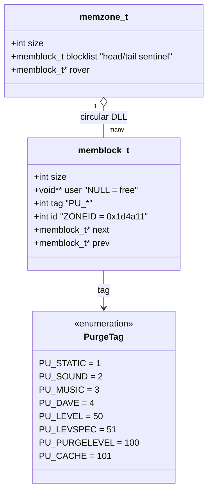
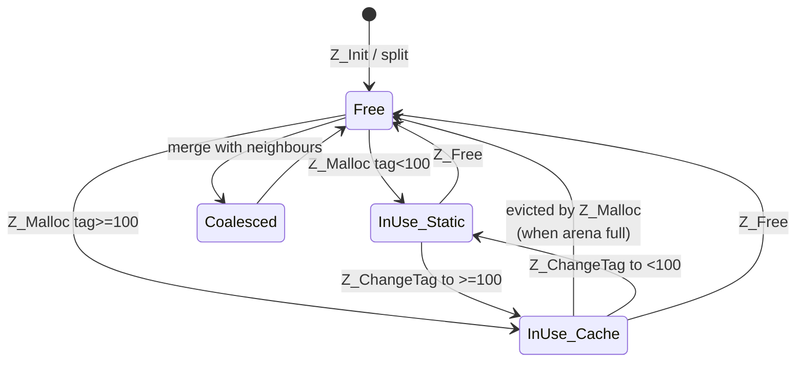

# 04 — Memory: the Zone allocator

DOOM allocates one giant block from the host OS at startup and then manages
all in-process memory itself. The allocator is in
[z_zone.c](../linuxdoom-1.10/z_zone.c) and [z_zone.h](../linuxdoom-1.10/z_zone.h).
This is one of the more durable ideas in the codebase — Quake reused it,
and the pattern reappears (with refinements) in every game engine since.

> "Z_zone was the only stuff that, according to John Carmack, might have been
> useful for Quake."  — header comment in [z_zone.h](../linuxdoom-1.10/z_zone.h).

## Goals

1. **Determinism**: no surprise allocation latency in the middle of a tic.
2. **Cache reclamation**: cheap one-shot eviction of an entire category of
   memory (e.g. all level data) without per-allocation tracking.
3. **No fragmentation surprises**: a single contiguous arena, walked by a
   "rover" pointer.
4. **Constraint era**: developed on machines with 4–8 MB of physical RAM and
   no useful virtual memory, where calling `malloc` was both slow and
   unpredictable.

## Class diagram of the data structures



A `memblock_t` is a header that immediately precedes the user-visible bytes
returned by `Z_Malloc`. `Z_Malloc` returns `(byte*)block + sizeof(memblock_t)`,
and `Z_Free` recovers the header by stepping back the same distance. The
`id == ZONEID` check in `Z_ChangeTag` is a corruption sentinel.

## Layout in memory

```
+-------------------------+   <- I_ZoneBase (one giant malloc / sbrk)
| memzone_t header        |
+-------------------------+
| memblock_t #1 header    |
+-------------------------+
| user payload of #1      |
+-------------------------+
| memblock_t #2 header    |
+-------------------------+
| user payload of #2      |
+-------------------------+
| ... rover usually here  |
+-------------------------+
| free block (large)      |
+-------------------------+
```

Two invariants from the source comment in [z_zone.c](../linuxdoom-1.10/z_zone.c):

1. **No gap between memblocks.** The block list covers the entire arena.
2. **Never two adjacent free blocks.** They are merged on free, so coalescing
   happens eagerly.

The `rover` pointer is a "next-fit" allocation cursor — the next allocation
search starts from where the previous one ended, not from the beginning.

## Purge tags — the key idea

Every block carries a numeric `tag`. The convention:

| Tag value range | Behaviour                                         |
|-----------------|---------------------------------------------------|
| `< 100`         | Static. Never auto-purged. Lives until `Z_Free`.   |
| `>= 100`        | Purgable. May be evicted at any allocation.        |

Specific tags carry semantics:

- `PU_STATIC` (1) — execution-lifetime data (e.g. lump directory).
- `PU_SOUND` / `PU_MUSIC` (2/3) — owned by the active sound/music instance.
- `PU_LEVEL` (50) — discarded on level exit via `Z_FreeTags(PU_LEVEL, PU_PURGELEVEL-1)`.
- `PU_LEVSPEC` (51) — special thinkers (doors, lifts) tied to a level.
- `PU_CACHE` (101) — cached lumps loaded from WAD; reclaimed transparently.

So when the renderer asks for a wall texture lump it does
`W_CacheLumpName("STARTAN3", PU_CACHE)`. If the texture is already in memory,
that returns a pointer in O(1). If not, it is loaded from disk and the
allocator may evict any other `PU_CACHE` block to make room. The block is
reachable via `lumpcache[lumpnum]` until purged, at which point that pointer
becomes stale; the allocator nulls the *user pointer* (`block->user = NULL`)
when purging. That is what the `void** user` field is for: it lets the
allocator reach back into client memory and clear the hanging pointer.

This is essentially a **weak reference** in C, twenty years before that term
was common in mainstream language design.

## Allocation activity

```mermaid
flowchart TD
    Start([Z_Malloc size,tag,user]) --> Need[need = size + memblock_t header,<br/>round up to alignment]
    Need --> Search[start = rover<br/>walk forward from rover]
    Search --> Avail{block free<br/>or purgable AND tag>=PU_PURGELEVEL?}
    Avail -- no --> Adv[advance to next block]
    Adv --> Wrap{wrapped past start?}
    Wrap -- yes --> OOM[I_Error "Z_Malloc: failed"]
    Wrap -- no --> Search
    Avail -- purgable --> Purge[free block via Z_Free<br/>this clears *block->user]
    Purge --> Search
    Avail -- free --> Big{block size >= need?}
    Big -- no --> Adv
    Big -- yes --> Split[split off remainder<br/>as new free block]
    Split --> Tag[tag block, set ZONEID<br/>set user pointer if non-null]
    Tag --> AdvRover[rover = next block]
    AdvRover --> Ret([return user pointer])
```

## State diagram of one block



`Z_FreeTags(low, high)` walks the list and frees every block whose tag is in
`[low, high]`. This is how level transitions are O(blocks) and not
O(allocations made during the level): one pass invalidates everything tagged
`PU_LEVEL` and `PU_LEVSPEC`.

## Practical lessons

- **Allocation is policy.** Choosing the right tag at allocation time encodes
  the lifetime contract; you do not need a separate destructor or RAII guard.
- **Cache as first-class state.** `PU_CACHE` makes "load lazily, evict on
  pressure" a one-line allocator call. Modern Java/C# weak-reference caches
  are a more general version of this idea.
- **Determinism beats cleverness.** The allocator is dumb: linear search,
  next-fit, no buddies, no slabs, no thread-safety. None of that matters
  because the workload is small (~16 MB), single-threaded, and bounded.
- **Sentinels are cheap.** `ZONEID` catches double-frees and out-of-bounds
  writes that scribble headers. The `Z_CheckHeap` debug function walks the
  list verifying invariants.

## What you would change today

- **Add allocation provenance.** `__FILE__`/`__LINE__` are stamped only on
  `Z_ChangeTag`. Modern allocators record per-block call sites for leak
  reporting.
- **Replace next-fit with size-segregated free lists** if you cared about
  worst-case search time on a long-running session.
- **Make the user-pointer back-reference type-safe.** Today you would express
  it as a `Weak<T>` smart pointer in Rust or C++.
- **Thread-safety.** Trivial to add but unnecessary then. A modern engine has
  per-frame, per-thread, and global arenas.

> Read next: [05 — Asset pipeline: WAD lumps](05_wad_pipeline.md).
