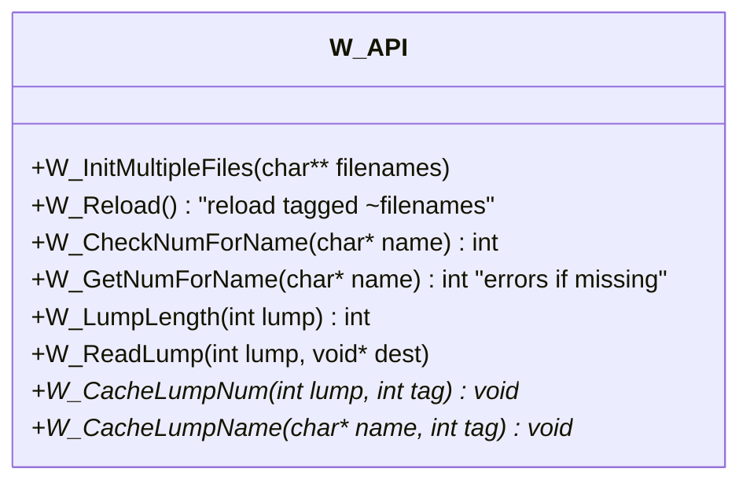
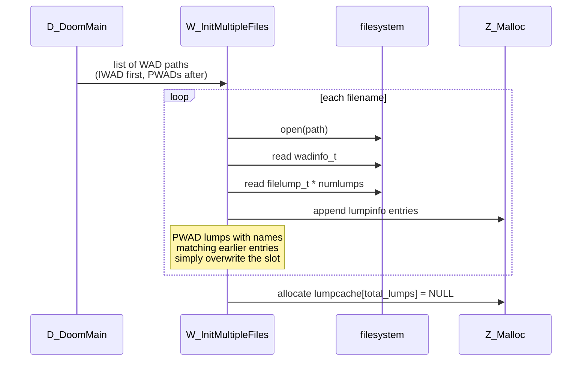

# 05 — Asset pipeline: WAD lumps

DOOM ships a single binary, but the code, art, sounds, music, levels, fonts,
palette, status bar — *everything that is not C* — lives outside, in a
"Where's All the Data?" file: a WAD. Two consequences fall out of this
decision:

1. The community could build levels and total-conversions without recompiling.
2. id could ship a free shareware demo and a paid registered version that were
   the same executable, distinguished only by which WAD was present.

Source: [w_wad.c](../linuxdoom-1.10/w_wad.c), [w_wad.h](../linuxdoom-1.10/w_wad.h),
[doomdata.h](../linuxdoom-1.10/doomdata.h).

## WAD on-disk layout

```
+--------------------------+   offset 0
| wadinfo_t (12 bytes)     |   "IWAD" or "PWAD" + numlumps + infotableofs
+--------------------------+
| lump 0 raw bytes         |
| lump 1 raw bytes         |
| ...                      |
| lump N-1 raw bytes       |
+--------------------------+   offset = infotableofs
| filelump_t lump 0 (16 B) |   filepos, size, name[8]
| filelump_t lump 1        |
| ...                      |
| filelump_t lump N-1      |
+--------------------------+
```

Two on-disk types from [w_wad.h](../linuxdoom-1.10/w_wad.h):

```c
typedef struct {
    char identification[4];    // "IWAD" or "PWAD"
    int  numlumps;
    int  infotableofs;
} wadinfo_t;

typedef struct {
    int  filepos;
    int  size;
    char name[8];              // NOT null-terminated; padded with zeros
} filelump_t;
```

A **lump** is a flat run of bytes. Its name (8 ASCII chars max, uppercased,
zero-padded) is its identifier. The format of the bytes is implied by name
conventions:

| Lump name pattern | Format               | Consumer        |
|-------------------|----------------------|-----------------|
| `PLAYPAL`         | 14 × 768 bytes (RGB palette) | [v_video.c](../linuxdoom-1.10/v_video.c) |
| `COLORMAP`        | 34 × 256 byte LUTs   | [r_data.c](../linuxdoom-1.10/r_data.c)   |
| `TEXTURE1`/`TEXTURE2` / `PNAMES` | composite texture defs | [r_data.c](../linuxdoom-1.10/r_data.c) |
| `THINGS`/`LINEDEFS`/`SIDEDEFS`/`VERTEXES`/`SEGS`/`SSECTORS`/`NODES`/`SECTORS`/`REJECT`/`BLOCKMAP` | per-map geometry  | [p_setup.c](../linuxdoom-1.10/p_setup.c) |
| `E1M1` ... `E4M9`, `MAP01`...`MAP32` | map separator lump | [g_game.c](../linuxdoom-1.10/g_game.c) |
| `*_START` / `*_END` | sprite/flat namespaces  | [r_things.c](../linuxdoom-1.10/r_things.c), [r_data.c](../linuxdoom-1.10/r_data.c) |
| sprite names `TROOA1`, `POSSA2A8`, … | rotation-tagged frames | [r_things.c](../linuxdoom-1.10/r_things.c) |
| `DSPISTOL`, `DSSHOTGN`, ... | 8-bit PCM SFX       | [s_sound.c](../linuxdoom-1.10/s_sound.c) |
| `D_E1M1`, ...     | MUS music            | [s_sound.c](../linuxdoom-1.10/s_sound.c) |
| `M_*`, `WI_*`, `STK*`, `STT*` | UI graphics      | [m_menu.c](../linuxdoom-1.10/m_menu.c), [wi_stuff.c](../linuxdoom-1.10/wi_stuff.c), [st_stuff.c](../linuxdoom-1.10/st_stuff.c) |

Map data is the most interesting case: the **sequence of lumps** between an
`ExMy`/`MAPxx` separator and the next separator constitutes one map, and
their order matches the `ML_*` enum in
[doomdata.h:43-56](../linuxdoom-1.10/doomdata.h#L43-L56):

```c
enum {
  ML_LABEL, ML_THINGS, ML_LINEDEFS, ML_SIDEDEFS,
  ML_VERTEXES, ML_SEGS, ML_SSECTORS,
  ML_NODES, ML_SECTORS, ML_REJECT, ML_BLOCKMAP
};
```

## In-memory representation

```mermaid
classDiagram
    class wadinfo_t {
        char[4] identification
        int numlumps
        int infotableofs
    }
    class filelump_t {
        int filepos
        int size
        char[8] name
    }
    class lumpinfo_t {
        char[8] name
        int handle    "fd of source WAD"
        int position
        int size
    }
    class lumpcache {
        void*[] entries  "indexed by lump #"
    }

    wadinfo_t --> filelump_t : N entries
    filelump_t ..> lumpinfo_t : converted at load
    lumpinfo_t <-- lumpcache : 1:1 by index
```

Source: [w_wad.h:35-66](../linuxdoom-1.10/w_wad.h#L35-L66).
The merged directory `lumpinfo[]` is built once by `W_InitMultipleFiles`. Later
WAD files (PWADs) override earlier ones for the same lump name — that is the
whole mod system in one rule.

## Public API



`W_CacheLumpNum` is the only function clients should normally use. It either
returns the already-cached pointer or allocates a `Z_Malloc` block of the
right size, reads the lump bytes into it, and stashes the pointer in
`lumpcache[lump]`. The `tag` argument is forwarded straight to the zone
allocator — usually `PU_CACHE` for transient assets and `PU_STATIC` for things
the caller wants to pin (e.g. textures referenced every frame).

## Load-time activity



## The "reloadable" trick

Filenames prefixed with `~` are flagged reloadable. `W_Reload` re-reads only
those files' lumps. This is how the developer build hot-reloaded a single
edited map without restarting the game — primitive but effective.

## What the WAD format does well

- **Stable names.** The 8-char ASCII name is a hash key that survives recompiles.
- **Late binding.** No code change is required to override a lump.
- **Self-describing directory.** No external manifest; the WAD index is in the file.

## What it does poorly (modern critique)

- **Names are 8 ASCII chars.** Collision-prone; namespace collisions resolved
  only by ordering (last loaded wins).
- **No lump-level compression.** Adequate at 1993 sizes, painful for big mods.
- **No dependency metadata.** Map lumps are a positional sequence rather than
  a self-described group; tools must know the schema.
- **Implicit type system.** The format of each lump is encoded in client
  code, not the file. Bad input crashes the game rather than failing
  validation.
- **No checksum.** Two PWADs with the same lumps but different bytes load
  silently in the wrong order.

The Quake `.pak` format addressed several of these (it is a full mini
filesystem with paths, directories, and per-entry sizes). Modern asset
formats (USD, glTF, Bethesda BSA, Steam VPK) keep the central idea — a flat
container with an index — and add types, compression, and integrity checks.

> Read next: [06 — Map runtime data model (BSP geometry)](06_map_data_model.md).
