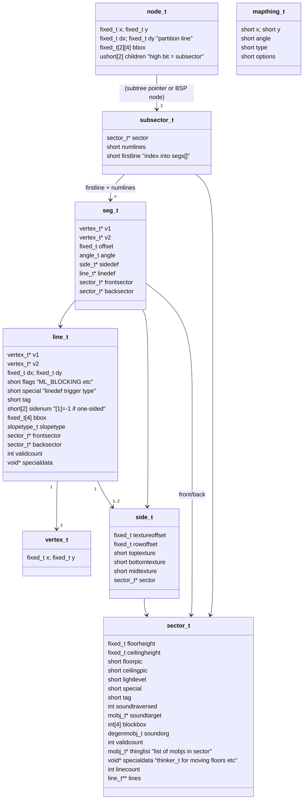
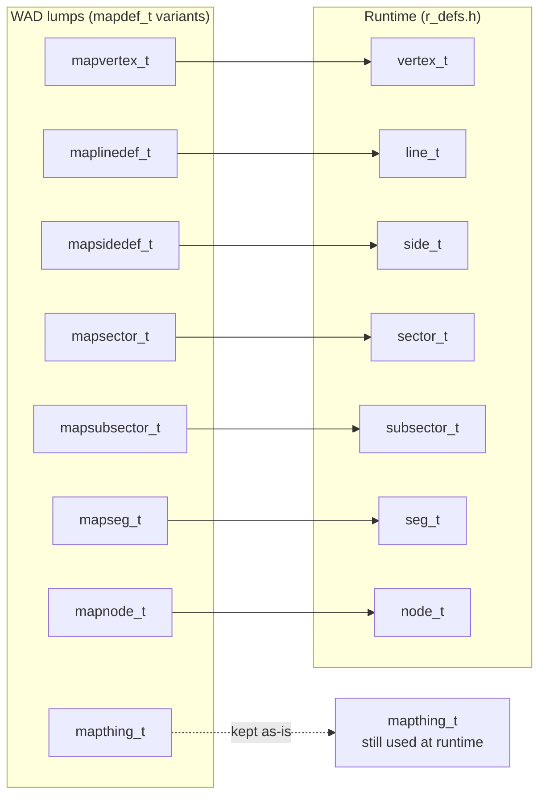
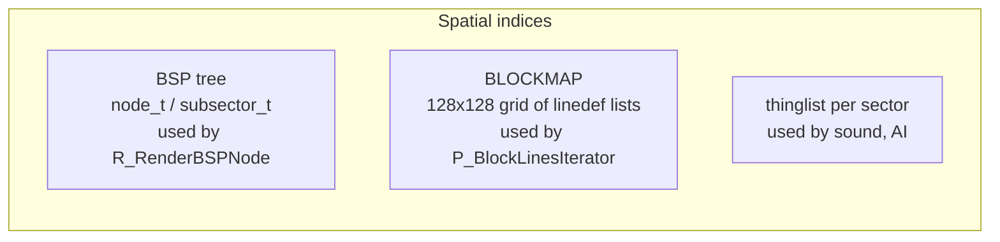
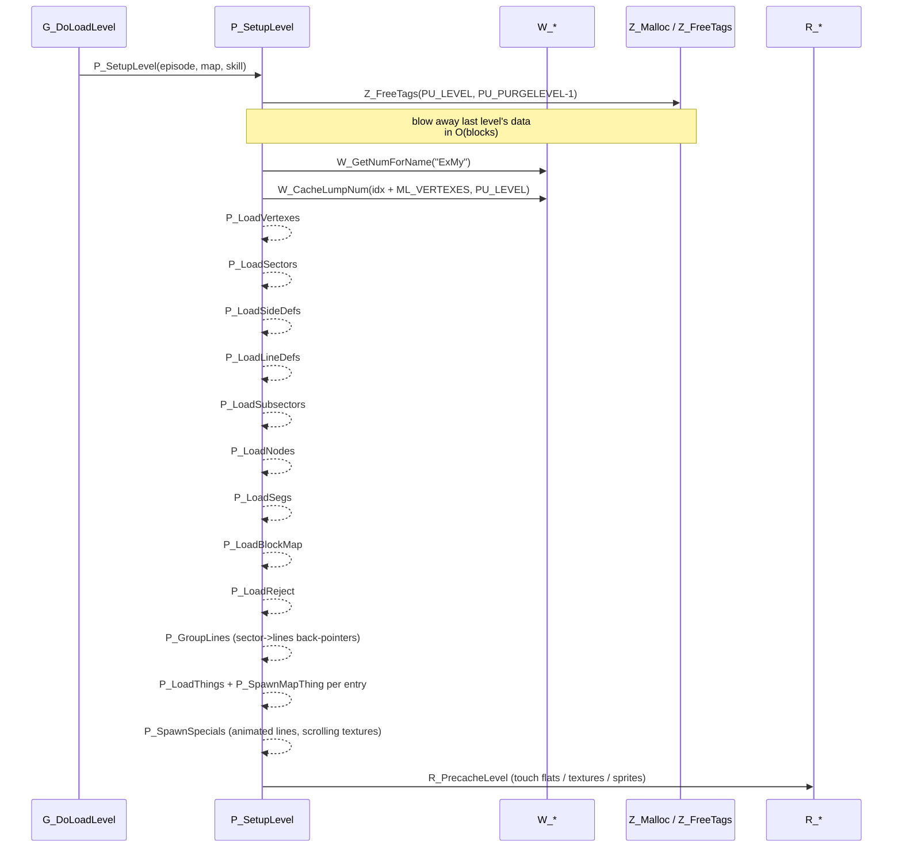

# 06 — Map runtime data model (BSP geometry)

When a level is loaded, [p_setup.c](../linuxdoom-1.10/p_setup.c) parses the
nine geometry lumps (`THINGS`, `LINEDEFS`, `SIDEDEFS`, `VERTEXES`, `SEGS`,
`SSECTORS`, `NODES`, `SECTORS`, `REJECT`, `BLOCKMAP`) and produces the
runtime structures defined in [r_defs.h](../linuxdoom-1.10/r_defs.h). The
runtime types are nearly isomorphic to the on-disk types — they substitute
absolute pointers for indices and add `validcount`, `bbox`, and `specialdata`
fields used during simulation and rendering.

This subsystem is shared between play (`P_*`) and refresh (`R_*`), which is
why its types live in `r_defs.h` and not `p_local.h`.

## Class diagram of the runtime map



## On-disk vs runtime



The conversion happens in `P_LoadVertexes`, `P_LoadLineDefs` etc. in
[p_setup.c](../linuxdoom-1.10/p_setup.c). A linedef's index `sidenum[0]` is
turned into `sides + sidenum[0]` during load, etc.

## The BSP tree

A **B**inary **S**pace **P**artitioning tree precomputed by an external tool
(e.g. `bsp`, `nodebuilder`) is shipped inside the WAD. Each internal node
stores a partition line; each leaf is a `subsector_t` that is **convex** in
2D — its segs (line segments) bound a convex polygon called a *subsector*.

```mermaid
flowchart TD
    N0[node 0<br/>partition (x,y) (dx,dy)] -->|right of partition| N1
    N0 -->|left| N2
    N1[node 1] -->|right| SS0(["subsector 5"])
    N1 -->|left| SS1(["subsector 7"])
    N2[node 2] -->|right| SS2(["subsector 12"])
    N2 -->|left| N3
    N3[node 3] --> SS3(["subsector 22"])
    N3 --> SS4(["subsector 26"])
```

The high bit of `children[i]` (`NF_SUBSECTOR = 0x8000`) flags whether the
child is a leaf or an interior node. The renderer walks this tree
front-to-back from the player's position; each subsector is drawn fully
before its sibling on the far side of the partition. This is the algorithm
that made DOOM possible on a 386: zero overdraw on solid walls.

## Two parallel spatial indices

Because Carmack didn't reuse the BSP for collision, the play simulation has
its own spatial index, the **blockmap**.



- **BSP** is queried with `R_PointInSubsector(x,y)` (which is also called
  from `P_*` to find a thing's containing sector at spawn time and after a
  move).
- **BLOCKMAP** is a uniform grid; each cell stores a list of linedefs that
  intersect it. `P_BlockLinesIterator` and `P_BlockThingsIterator` are how
  movement, line-of-sight, and missile collision queries find candidates
  cheaply. See [p_maputl.c](../linuxdoom-1.10/p_maputl.c).
- **REJECT** is a precomputed sector-vs-sector visibility bit-matrix used to
  short-circuit line-of-sight queries that would otherwise walk the BSP.

In the README ([README.TXT](../README.TXT)), Carmack flags this duplication
as a regret: "I used the BSP tree for rendering things, but I didn't realize
at the time that it could also be used for environment testing."

## Map load activity



The spatial structure is **inert** — no thinker walks it. It is a frozen
input to the simulation. Only the dynamic state (mobjs, moving sectors)
changes during play.

> Read next: [07 — Actors: mobj_t and the thinker system](07_mobj_thinker.md).
