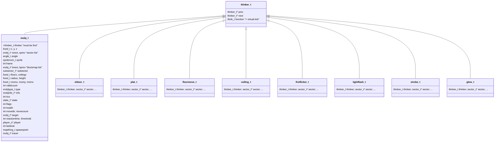
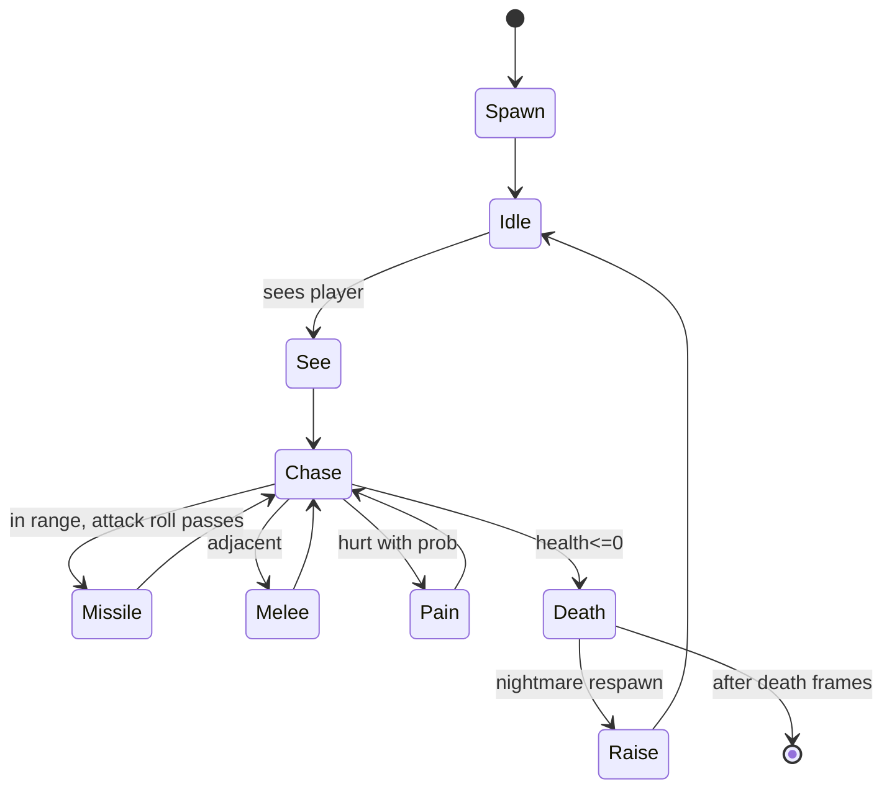
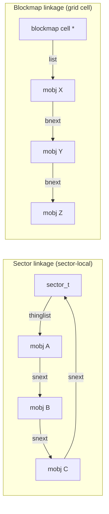

# 07 — Actors: mobj_t and the thinker system

Every dynamic entity in DOOM — players, monsters, projectiles, dropped items,
sound origins, even certain animated map elements — derives from one
discriminated structure (`thinker_t`) and one concrete subtype family
(`mobj_t`). This is essentially **single inheritance with virtual dispatch
implemented in C using a function pointer field**, four years before C++ was
practical for game code.

## The thinker base

Source: [d_think.h](../linuxdoom-1.10/d_think.h).

```c
typedef union {
    actionf_p1 acp1;   // void (*)(void*)
    actionf_v  acv;    // void (*)(void)
    actionf_p2 acp2;   // void (*)(void*, void*)
} actionf_t;

typedef actionf_t think_t;

typedef struct thinker_s {
    struct thinker_s* prev;
    struct thinker_s* next;
    think_t           function;
} thinker_t;
```

This is your "object header." Anything that wants to be ticked is a struct
whose first field is `thinker_t`. The pointer-cast trick (`(thinker_t*)x`)
is safe because C guarantees a struct's first field begins at offset 0.

## Class hierarchy in C



Sources for the level-special thinker types:
[p_doors.c](../linuxdoom-1.10/p_doors.c),
[p_plats.c](../linuxdoom-1.10/p_plats.c),
[p_floor.c](../linuxdoom-1.10/p_floor.c),
[p_ceilng.c](../linuxdoom-1.10/p_ceilng.c),
[p_lights.c](../linuxdoom-1.10/p_lights.c),
[p_spec.h](../linuxdoom-1.10/p_spec.h).

## How dispatch works

```c
// p_tick.c:101
void P_RunThinkers (void)
{
    thinker_t* currentthinker = thinkercap.next;
    while (currentthinker != &thinkercap) {
        if (currentthinker->function.acv == (actionf_v)(-1)) {
            // marked for removal
            currentthinker->next->prev = currentthinker->prev;
            currentthinker->prev->next = currentthinker->next;
            Z_Free(currentthinker);
        } else if (currentthinker->function.acp1) {
            currentthinker->function.acp1(currentthinker);
        }
        currentthinker = currentthinker->next;
    }
}
```

Three things to notice:

1. **Doubly-linked circular list** with sentinel `thinkercap`. List
   manipulation is a one-liner because there are no edge cases at the ends.
2. **Function pointer is the dispatch.** A door uses
   `function.acp1 = T_VerticalDoor`, a moving floor uses `T_MoveFloor`, a
   regular monster uses `P_MobjThinker`. Each takes the thinker as `void*`.
3. **Lazy deletion.** `P_RemoveThinker` does not unlink; it sets
   `function.acv = (actionf_v)(-1)`. The next pass through the list does the
   actual unlink and `Z_Free`. This keeps the iterator safe — you can call
   `P_RemoveThinker` from inside another thinker's tick without invalidating
   the loop.

## State machine for mobj_t

A monster's animation, AI, and combat behaviour are **all driven by the same
state table**. `state_t` (in [info.h](../linuxdoom-1.10/info.h)) is:

```c
typedef struct {
    spritenum_t sprite;         // which sprite lump family
    int         frame;          // sub-frame
    int         tics;           // how many tics in this state
    actionf_t   action;         // optional callback ("codepointer")
    statenum_t  nextstate;      // where to go after `tics`
    int         misc1, misc2;
} state_t;
```

A mobj's `state` pointer is advanced by `P_SetMobjState`. Per tic, the mobj's
`tics` countdown decrements; on zero the state is replaced with `nextstate`,
which fires that state's `action` callback. So a "former human"'s walk →
shoot → walk cycle is a closed graph of `state_t` entries with `A_Chase`,
`A_PosAttack`, `A_FaceTarget` callbacks at strategic nodes. The full state
table is generated from a multigen text file and lives in
[info.c](../linuxdoom-1.10/info.c).



Each named state above is *itself* a sequence of `state_t` rows in the table.
The graph is data, not code — adding a new monster is largely a new entry in
the state table plus a new `mobjinfo_t` row.

## Sector links and blockmap links

Every mobj is linked into two lists:



These are managed only by `P_SetThingPosition` / `P_UnsetThingPosition`. Any
change of `(x,y)` must go through them. The renderer walks the sector list
when drawing sprites in a subsector; the play simulation walks the blockmap
list when looking for collisions.

`MF_NOSECTOR` and `MF_NOBLOCKMAP` flags allow opting out — invisible "sound
origin" mobjs (like the centre of a sector) skip the sector list, while
purely decorative non-interacting mobjs skip the blockmap.

## Player as a special mobj

The player struct ([d_player.h](../linuxdoom-1.10/d_player.h)) holds
inventory, view bobbing, weapon state, etc., but its world-side state is in
the `mobj_t` it points to (`player->mo`). Conversely the mobj's
`player` pointer is non-null only for player avatars. This is the
"composition with a back-reference" pattern that lets player-specific code
ignore the world simulator's generic mobj logic, and vice versa.

## Lessons

- **Single field at offset 0** is enough for "polymorphism" if you have type
  discipline.
- **Lazy deletion in shared lists** is a real pattern. It generalises to
  iterators in modern languages: never invalidate while iterating; mark and
  sweep after the loop.
- **Data-driven state machines** are easier to balance and mod than
  hand-coded ones. Even without a designer-facing tool, the table format is
  modifiable without rebuilding.
- **Two indices for two queries.** Renderer wants "all things in this
  subsector"; simulation wants "all things in this 128×128 cell". Maintaining
  both is fine when the writes are few and the reads are many.

> Read next: [08 — Player state](08_player.md).
