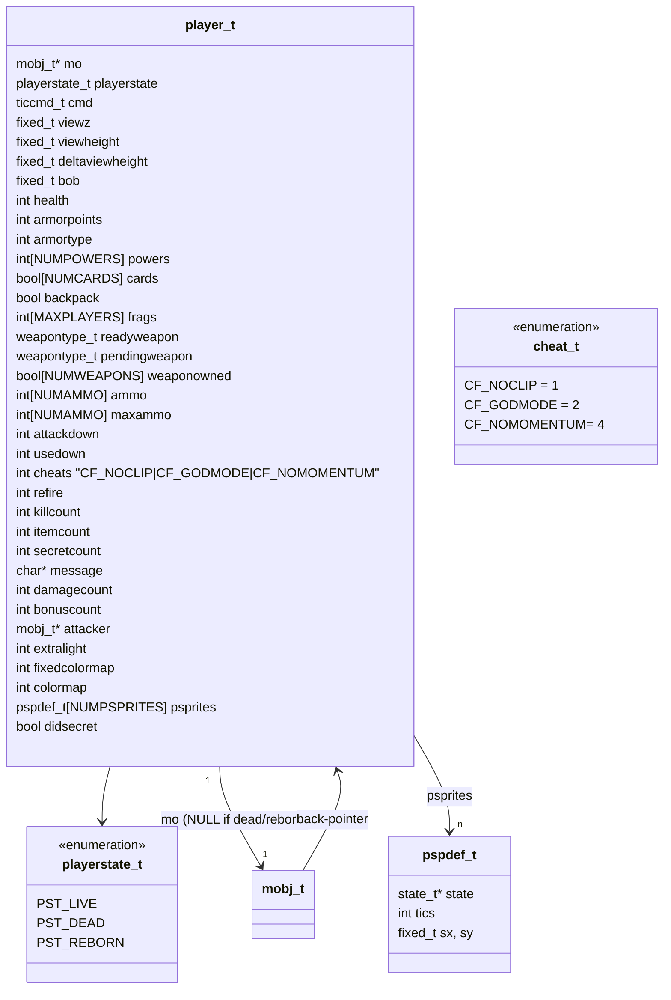
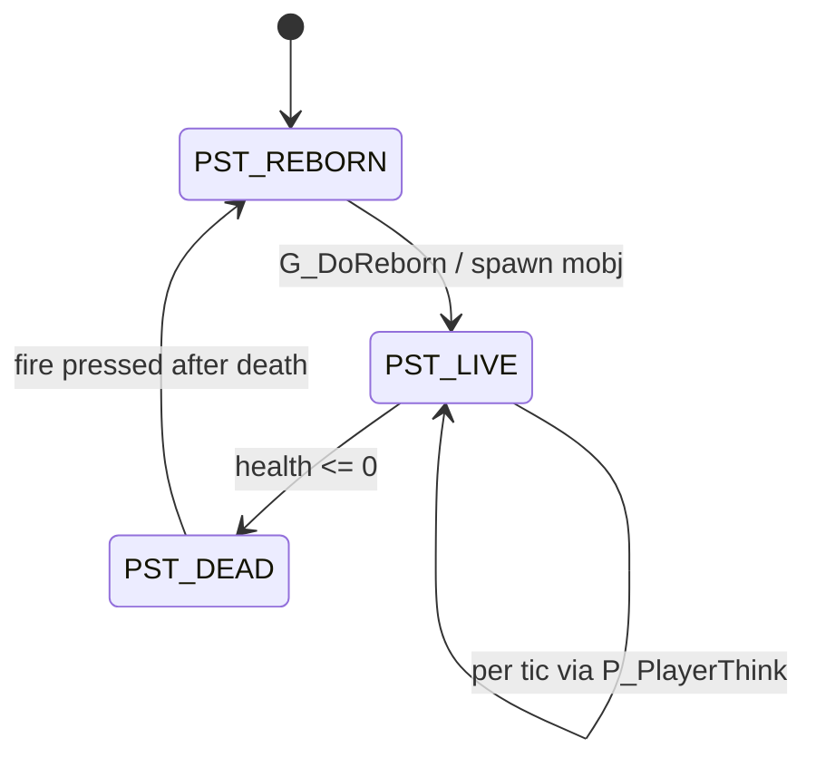
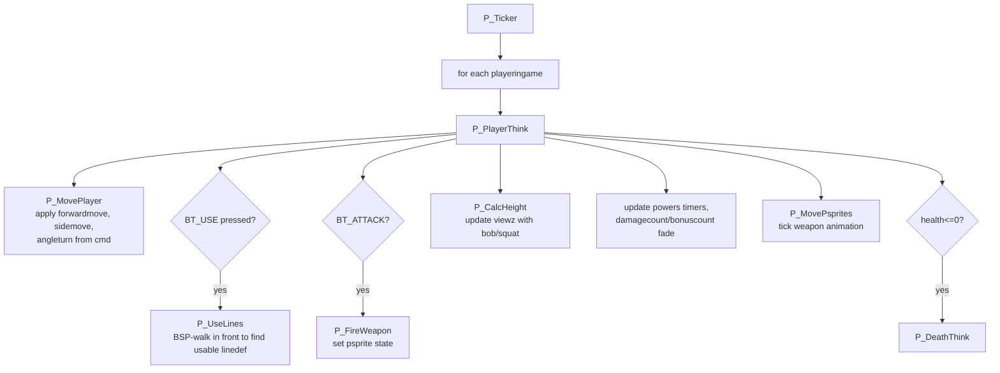
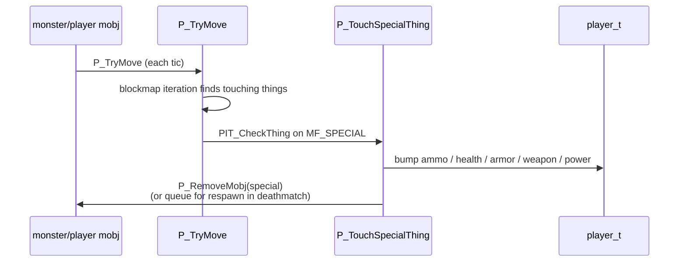

# 08 — Player state

A player is two things: a world-side actor (`mobj_t`, see
[07](07_mobj_thinker.md)) and a player-side struct that carries everything
that is *not* world geometry — inventory, view, HUD state, weapon
animation, cheats, intermission accounting.

Source: [d_player.h](../linuxdoom-1.10/d_player.h),
[p_user.c](../linuxdoom-1.10/p_user.c),
[p_pspr.c](../linuxdoom-1.10/p_pspr.c) (player sprites = first-person weapon),
[p_inter.c](../linuxdoom-1.10/p_inter.c) (pickup/damage).

## Class diagram

## Player state machine

Reborn handling is a good example of "one place that owns lifecycle":
`G_PlayerReborn` clones the persistent stats (frags, kill counts) into the
new player object and zeroes everything else.

## Per-tic player simulation

`P_MovePlayer` is interesting because it is the bridge from `ticcmd_t`
deltas to `mobj_t` `momx`/`momy`/`angle`. Movement is then resolved by the
shared `P_TryMove` code (used by every walking mobj) in
[p_map.c](../linuxdoom-1.10/p_map.c).

## First-person weapon as a tiny state machine

`pspdef_t[NUMPSPRITES]` is a 2-slot mini state machine for the weapon and
muzzle flash sprites. It uses the same `state_t` infrastructure as monsters
(see [07](07_mobj_thinker.md)) — the weapon's "ready / fire / flash /
reload" frames are just another walk through the global state table. Action
callbacks like `A_FirePistol`, `A_Punch`, `A_FireBFG` live in
[p_pspr.c](../linuxdoom-1.10/p_pspr.c).

## Items and pickups

Caps and limits are encoded in the `mobjinfo_t` table entries and in
constants in [d_items.c](../linuxdoom-1.10/d_items.c) /
[p_inter.c](../linuxdoom-1.10/p_inter.c).

## Cheats

`cheats` is a bitfield. `IDDQD` toggles `CF_GODMODE`, `IDCLIP` toggles
`CF_NOCLIP`. The string-matching state machine is in
[m_cheat.c](../linuxdoom-1.10/m_cheat.c). It is a cute exercise in writing a
ring buffer that recognises a small fixed alphabet — read it as an example
of "the simplest thing that works."

## Intermission stats

After each level the per-player counts (`killcount`, `itemcount`,
`secretcount`, `frags[]`) are copied into a `wbplayerstruct_t` and passed to
`WI_Start` ([wi_stuff.c](../linuxdoom-1.10/wi_stuff.c)). The intermission
screen is, architecturally, a *separate* gamestate (`GS_INTERMISSION`) with
its own ticker and drawer — see [12](12_game_state.md).

> Read next: [09 — Renderer (BSP traversal pipeline)](09_renderer.md).
