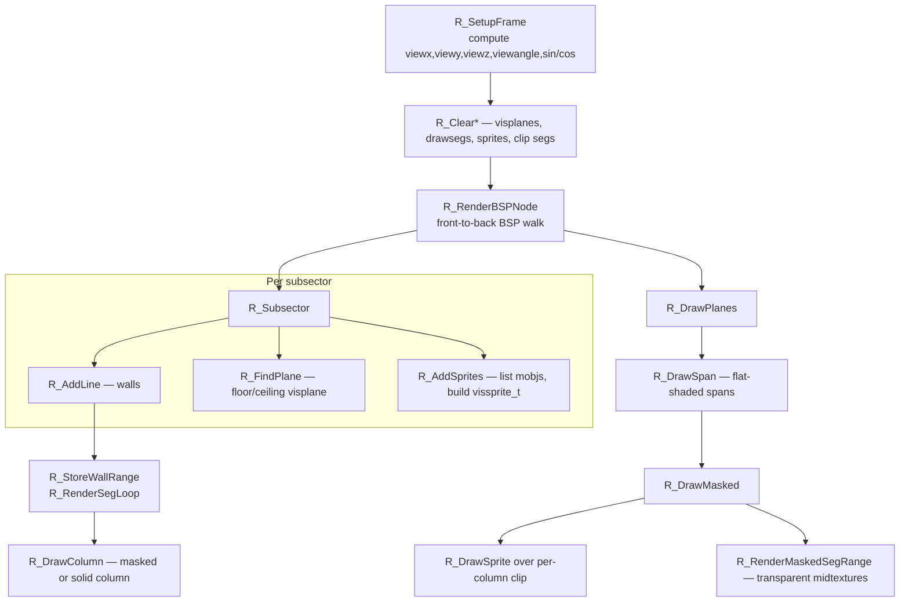
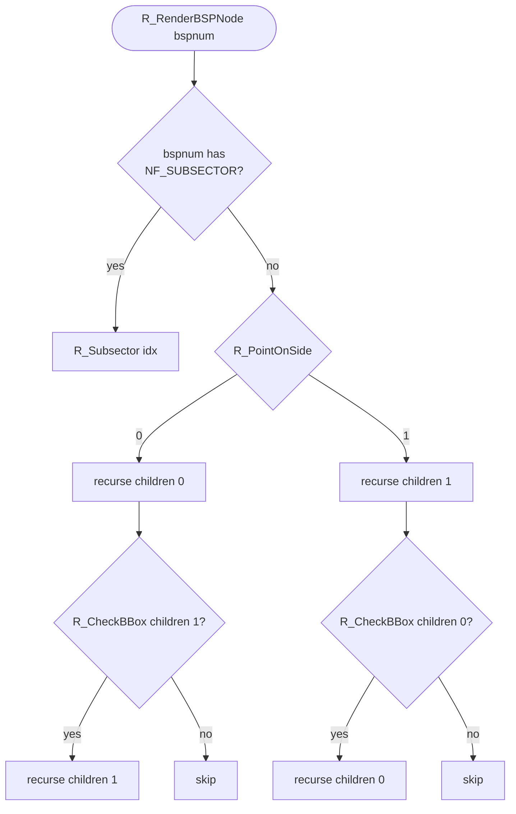
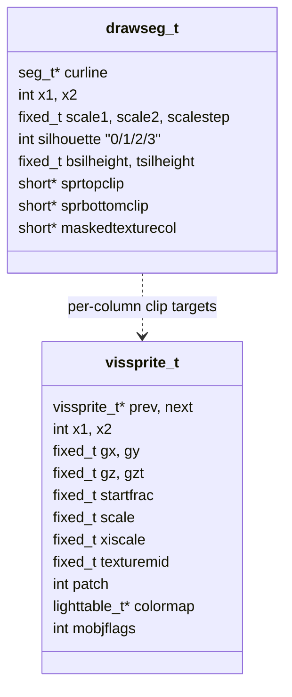

# 09 — Renderer (BSP traversal pipeline)

The DOOM renderer is the headline subsystem and the original reason the game
was famous. It targets a 320×200 8-bit indexed framebuffer and produces a
perspective view of a 2.5D map (heights but no slopes, no looking
up/down) at ~35 fps on a 386. The algorithm is **front-to-back BSP traversal
producing horizontal/vertical screen-space spans of constant Z**.

Source files: [r_main.c](../linuxdoom-1.10/r_main.c),
[r_bsp.c](../linuxdoom-1.10/r_bsp.c),
[r_segs.c](../linuxdoom-1.10/r_segs.c),
[r_plane.c](../linuxdoom-1.10/r_plane.c),
[r_things.c](../linuxdoom-1.10/r_things.c),
[r_data.c](../linuxdoom-1.10/r_data.c),
[r_draw.c](../linuxdoom-1.10/r_draw.c),
[r_local.h](../linuxdoom-1.10/r_local.h).

## Top-level orchestration

`R_RenderPlayerView` is 30 lines. Source:
[r_main.c:870-898](../linuxdoom-1.10/r_main.c#L870-L898).

```c
void R_RenderPlayerView (player_t* player)
{
    R_SetupFrame(player);
    R_ClearClipSegs();
    R_ClearDrawSegs();
    R_ClearPlanes();
    R_ClearSprites();
    NetUpdate();
    R_RenderBSPNode(numnodes-1);   // walls + visplanes + sprite list
    NetUpdate();
    R_DrawPlanes();                 // floors and ceilings
    NetUpdate();
    R_DrawMasked();                 // sprites + masked midtextures
    NetUpdate();
}
```

Three things to read carefully:

1. The **render is a three-pass pipeline**: walls (and silhouettes for
   sprite clipping), then planes, then masked things (sprites plus
   transparent walls).
2. `NetUpdate()` is sprinkled between phases. The renderer is a long synchronous
   block of CPU work; calling `NetUpdate` periodically keeps the network ack
   timer alive without dedicating a thread to it. This is **cooperative
   multitasking inside a single function** — a pattern you would today
   implement with async/await or a poll thread.
3. The order is *front-to-back* for solid geometry but *back-to-front* for
   masked geometry. The first pass establishes per-column clip bounds;
   subsequent passes never overdraw.

## High-level pipeline



## BSP traversal

`R_RenderBSPNode` recurses on the BSP tree, choosing the **near child first**.
For each interior node it computes `R_PointOnSide(viewx, viewy, node)` and
visits the side the player is on, then potentially the far side after
checking that the far child's bounding box is at least partially visible.



`R_CheckBBox` projects a node's child bounding box to screen space and checks
whether any column is unclipped. The clip state is kept in **`solidsegs`**
([r_bsp.c](../linuxdoom-1.10/r_bsp.c)) — a sorted list of "ranges of columns
that are already entirely covered by solid walls." When `solidsegs` covers
all columns in the box's range, the far child is cut: this is occlusion
culling on top of the BSP walk.

## Walls: drawing one seg

For each `seg_t` in a visited subsector, `R_AddLine` decides whether the seg
is a *one-sided* (solid) wall or *two-sided* (a portal between two sectors).

- Solid: contributes a column range to `solidsegs` and produces a
  `drawseg_t` in `R_StoreWallRange`. The drawseg records per-column scale,
  silhouette flags, and pointers into the column-clip arrays
  (`sprtopclip` / `sprbottomclip`) used later for sprites.
- Two-sided: may produce *upper* and *lower* wall pieces (where floors or
  ceilings of the two sectors do not match) and a *masked midtexture* (e.g.
  iron bars, fences). Upper and lower contribute to `solidsegs` only over
  their span; masked midtextures defer drawing to `R_DrawMasked`.

The actual span is rendered in `R_RenderSegLoop`, one screen column at a
time, calling `R_DrawColumn` (or the assembly-optimised `R_DrawColumnLow`,
`R_DrawFuzzColumn`, `R_DrawTranslatedColumn`).

## Floors and ceilings: visplanes

A **visplane** is a contiguous run of columns that share the same floor
texture, height, and light level. As the BSP walk processes subsectors,
floors and ceilings get merged into existing visplanes when they match, or
get split when they do not. After the walk finishes, `R_DrawPlanes` rasterises
each visplane row by row, calling `R_DrawSpan`.

Source: [r_plane.c](../linuxdoom-1.10/r_plane.c) and `visplane_t` in
[r_defs.h:460-480](../linuxdoom-1.10/r_defs.h#L460-L480).

```c
typedef struct {
  fixed_t height;
  int     picnum;
  int     lightlevel;
  int     minx, maxx;
  byte    pad1;
  byte    top[SCREENWIDTH];      // top    pixel row per column
  byte    pad2; byte pad3;
  byte    bottom[SCREENWIDTH];   // bottom pixel row per column
  byte    pad4;
} visplane_t;
```

The padding bytes around `top[]` and `bottom[]` are deliberate
**stop-bytes** (`0xff`): the inner loop walks `top[x]` for varying x and the
sentinel value lets the loop test one byte instead of comparing against
`maxx+1`. A neat micro-optimisation that reads as obscure today but mattered
on a 486.

The number of visplanes is **bounded** (`MAXVISPLANES`). Levels that exceeded
the bound triggered a famous "visplane overflow" crash. Modern source ports
removed the limit by switching to dynamic allocation.

## Sprites: the visible list

For each subsector, `R_AddSprites` walks `sector->thinglist` and projects
each mobj into screen space, producing a `vissprite_t`
([r_defs.h:375-409](../linuxdoom-1.10/r_defs.h#L375-L409)) only if it lies
inside the view frustum. Sprites are then sorted **back-to-front** in
`R_DrawMasked` and clipped per-column against the wall silhouettes recorded
during the wall pass — this is what `sprtopclip` and `sprbottomclip` on
`drawseg_t` are for.



## Lighting

Lighting in DOOM is **palette swapping**, not arithmetic. There is one base
palette (`PLAYPAL`) and 33 darkened versions of it stored in `COLORMAP`. To
shade a wall pixel by distance, the renderer indexes a precomputed
`lighttable_t*` for that scale/light combination. So a "lit pixel" is one
indirection deeper than an "unlit pixel": `dest[i] = colormap[ source[i] ]`.

Source: [r_data.c R_InitColormaps](../linuxdoom-1.10/r_data.c),
[r_main.c R_InitLightTables](../linuxdoom-1.10/r_main.c#L614).

## Patches and textures

A drawn wall texture is composed at load time from one or more **patches**
(rectangular masked images) defined in `TEXTURE1`/`TEXTURE2`/`PNAMES`. The
column-major layout (`patch_t.columnofs[]` indexes into a sequence of
`post_t` runs) is what makes column-rendering cheap — to draw a single
column you index once into the patch and walk a list of vertical posts.

```c
typedef struct {
    short width;
    short height;
    short leftoffset;     // for sprites: pixels to the left of origin
    short topoffset;
    int   columnofs[8];   // really [width]
} patch_t;

typedef struct { byte topdelta; byte length; } post_t;
```

A composite texture (e.g. a 256-pixel-wide wall) is built once at level
load — the renderer treats it as if it were a single patch.

## Performance properties

| Phase     | Per-frame cost           | Bottleneck                          |
|-----------|--------------------------|-------------------------------------|
| BSP walk  | O(visited nodes)         | branch prediction, memory latency   |
| Walls     | O(visible columns)       | L1 hit rate; column inner loop      |
| Planes    | O(visible pixels)        | divisions per span (per-step delta) |
| Sprites   | O(visible mobjs × pixels)| sort + per-column clip              |

The seminal optimisation was making *the inner loop of `R_DrawColumn` an
assembly routine* — see [tmap.S](../linuxdoom-1.10/tmap.S) (assembly source
referenced in the FILES list). On the linux build, that file isn't actually
compiled; the C `R_DrawColumn` in [r_draw.c](../linuxdoom-1.10/r_draw.c) is
used instead, which is why the linux port is somewhat slower.

## What Carmack would change (per his README)

> "The way the rendering proceeded from walls to floors to sprites could be
> collapsed into a single front-to-back walk of the bsp tree to collect
> information, then draw all the contents of a subsector on the way back up
> the tree. It requires treating floors and ceilings as polygons, rather
> than just the gaps between walls, and it requires clipping sprite
> billboards into subsector fragments, but it would be The Right Thing."

This is essentially how Quake's renderer was structured the next year, and
it removes both the visplane limit and the multi-pass ordering complexity.

> Read next: [10 — Sound subsystem and external sndserv](10_sound.md).
