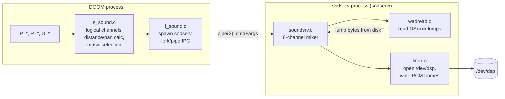
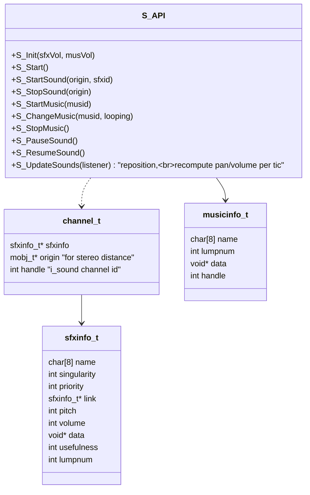
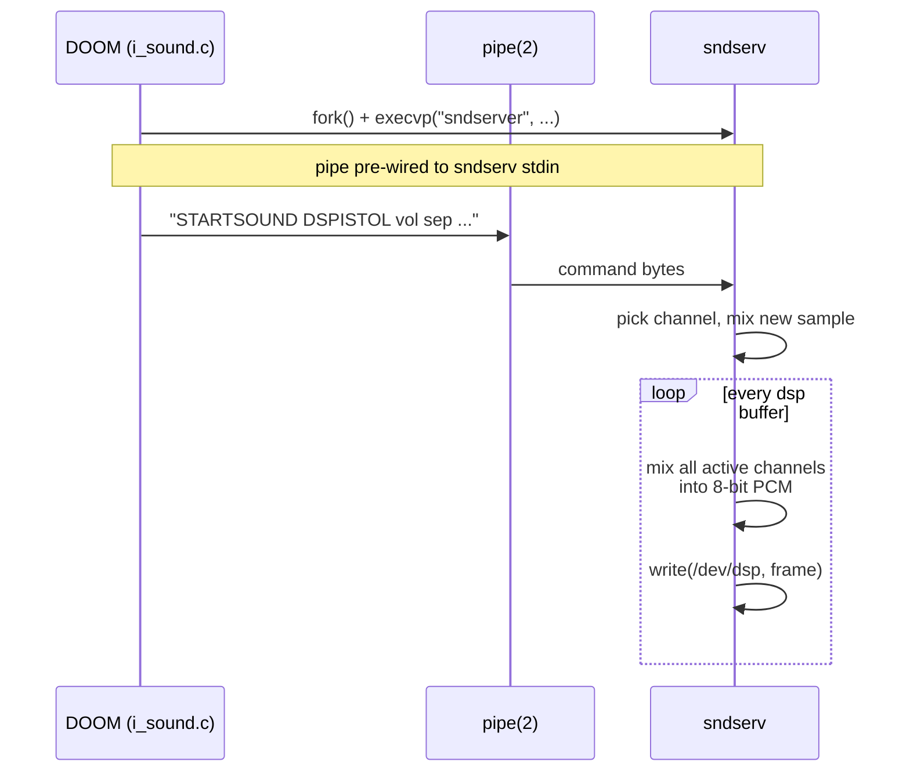

# 10 — Sound subsystem and external sndserv

DOOM separates **logical sound** ("a chaingun fired at world position
(x,y)") from **physical sound** (mixing 8 channels of 11 kHz mono PCM and
writing to `/dev/dsp`). The boundary runs along `s_sound` ↔ `i_sound`,
and on Linux the *physical* mixer is moved out into a **separate process**
(`sndserv`) connected by a pipe.

This is a clean architectural decision worth studying because (a) it lets
the engine continue running if audio is buggy or absent, and (b) it
isolates real-time audio scheduling from the variable-latency game loop
without introducing threading.

## Components



## What s_sound owns

Source: [s_sound.c](../linuxdoom-1.10/s_sound.c),
[s_sound.h](../linuxdoom-1.10/s_sound.h),
[sounds.h](../linuxdoom-1.10/sounds.h),
[sounds.c](../linuxdoom-1.10/sounds.c).



The full SFX table (`S_sfx[]`) lives in [sounds.c](../linuxdoom-1.10/sounds.c)
and is generated. Each entry knows its lump name, default volume, priority
(used when more sounds want to play than there are channels), and a
`singularity` flag to say "only one of me at a time" (used for chainsaw to
prevent multiple overlapping loops).

`S_StartSound(origin, sfx)` does:

1. Compute distance from `origin` to listener (`players[displayplayer].mo`).
2. Reject if too far.
3. Compute pan from relative angle (left ear vs right ear).
4. Pick a channel: free slot, or evict lowest priority.
5. Hand off to `I_StartSound(sfx, channel, vol, pan, ...)`.

`S_UpdateSounds` is called once per display frame from `D_DoomLoop`
([d_main.c:392](../linuxdoom-1.10/d_main.c#L392)) so that a moving sound
source's pan and volume track the listener.

## What i_sound owns

Source: [i_sound.c](../linuxdoom-1.10/i_sound.c),
[i_sound.h](../linuxdoom-1.10/i_sound.h),
plus the helper [linuxdoom-1.10/i_sound.c](../linuxdoom-1.10/i_sound.c) on
this build forks `sndserv` and pipes commands.

```c
void  I_InitSound(void);
void  I_UpdateSound(void);
void  I_SubmitSound(void);
int   I_StartSound(int id, int vol, int sep, int pitch, int priority);
void  I_StopSound(int handle);
int   I_SoundIsPlaying(int handle);

void  I_PlaySong(int handle, int looping);
void  I_PauseSong(int handle);
void  ...
```

The Linux build supports two configurations selected at compile time in
[doomdef.h](../linuxdoom-1.10/doomdef.h#L84):

- `SNDSERV` defined (default): commands are written over a pipe to the
  forked `sndserv` process. `I_SubmitSound` is a no-op because mixing
  happens in the other process.
- `SNDINTR` defined: an interrupt-driven async mixer in the same process.
  Experimental and not the default.

Either way, **clients of `S_*` see no difference**.

## What sndserv owns

Source: [sndserv/soundsrv.c](../sndserv/soundsrv.c),
[sndserv/linux.c](../sndserv/linux.c),
[sndserv/wadread.c](../sndserv/wadread.c).

`sndserv` is a small standalone binary. Its responsibilities:

- Read its own copy of the WAD on startup (via
  [wadread.c](../sndserv/wadread.c) — note the duplicated WAD-reading code,
  a real-world cost of process separation).
- Read commands from stdin (a pipe inherited from the parent DOOM process).
- Maintain 8 fixed-rate sample mixing channels.
- Output to `/dev/dsp` at 11025 Hz, 8-bit unsigned.



Music is handled differently — there is no MIDI synthesis in the open
source release. Music output is left as a stub.

## Why separate processes (and not threads)

Pre-2.x kernels on Linux had clunky thread support and BSD didn't have
threads at all. A second *process* with a *pipe* was the lowest-common-
denominator IPC mechanism that worked everywhere. The trade-offs:

| Pros                                              | Cons                                  |
|---------------------------------------------------|---------------------------------------|
| Audio glitch can't crash the game                 | Two address spaces, two WAD parsers   |
| Mixer scheduling is the kernel's problem          | IPC latency (one tic at minimum)      |
| Portable — same model on any POSIX                 | Audio settings via stringly-typed CLI |
| Simpler than locks/queues                         | Harder to debug end-to-end            |

A modern engine would still keep the boundary, but implement it with a
lock-free SPSC ring buffer between an audio callback thread and the game
thread. The architectural lesson — **mixing belongs on its own scheduler**
— is unchanged.

## Network sound? No.

Sound is **not** part of the deterministic simulation. Two players in a
netgame can hear different things based on their positions and channel
contention. The game-side state is: "which mobj is making which sfx, with
what priority." The mixing decision is local. This avoids broadcasting a
firehose of "play sound at (x,y)" events over the wire.

> Read next: [11 — Networking: lockstep peer-to-peer](11_networking.md).
