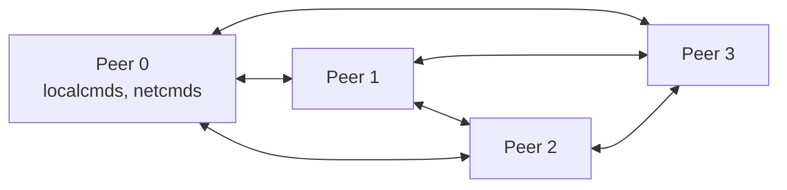
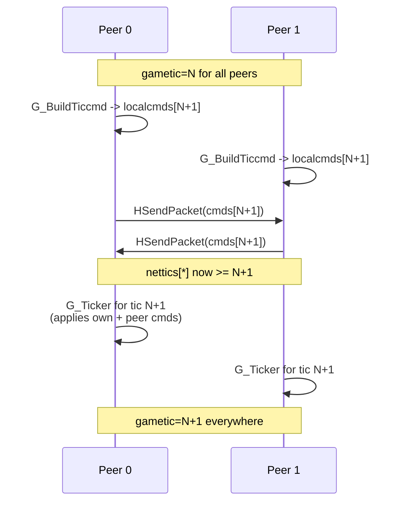
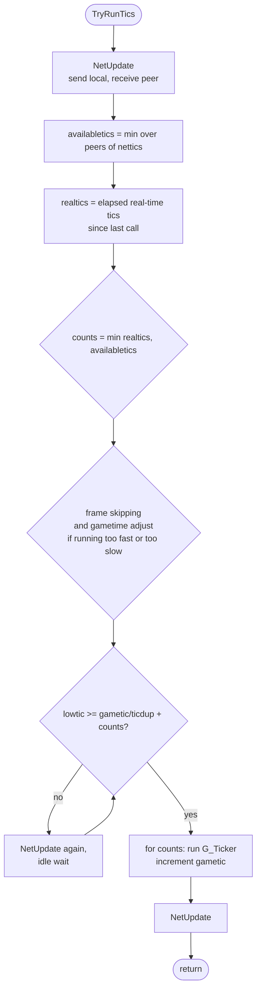
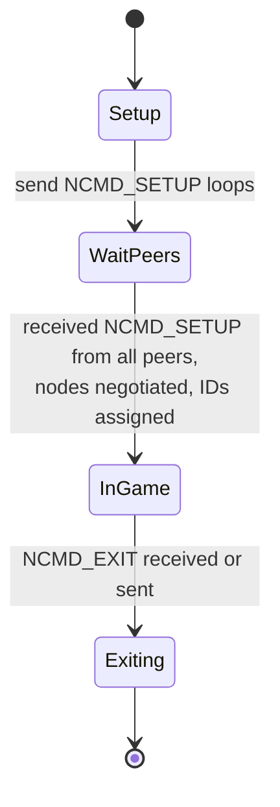
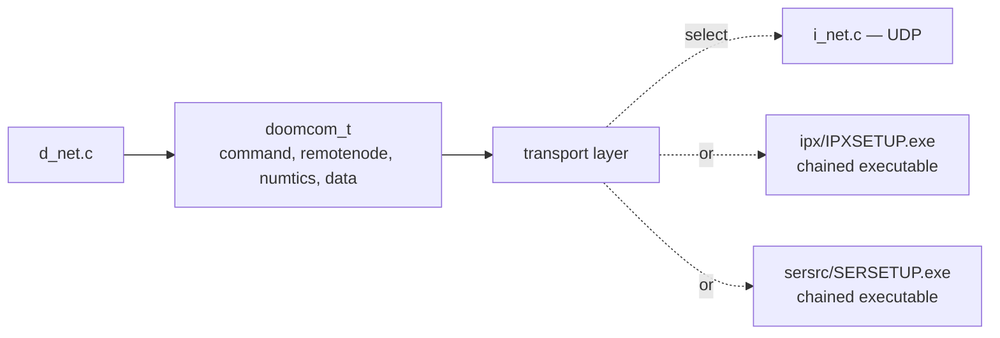

# 11 — Networking: lockstep peer-to-peer

DOOM multiplayer is a **deterministic lockstep peer-to-peer simulation**.
There is no server. Each peer runs the same simulation seeded with the same
inputs and produces the same world. The only thing transmitted on the wire
is `ticcmd_t` — eight bytes per player per tic.

Source: [d_net.c](../linuxdoom-1.10/d_net.c) (OS-independent protocol),
[i_net.c](../linuxdoom-1.10/i_net.c) (Linux UDP transport),
[ipx/](../ipx/) (DOS IPX driver, separate executable),
[sersrc/](../sersrc/) (DOS serial/modem driver, separate executable).

## Architectural choice in one sentence

> Send only what the player did, and run the simulation everywhere.

The bandwidth math at 35 tics/s × 4 players × 8 bytes = **1.12 KB/s**, well
within a 14.4 kbps modem. The trade-off you accept is that **every action
is delayed by at least one round-trip** because no peer can advance until
all peers' inputs for that tic have arrived. This is what gives DOOM its
"choppy on bad lines" feel — but also what makes its multiplayer perfectly
fair: every peer sees the same world.

## Topology



It is a fully connected mesh, up to `MAXPLAYERS = 4`
([doomdef.h:119](../linuxdoom-1.10/doomdef.h#L119)).

## What gets sent

```c
typedef struct {
    int     checksum;          // high bits hold flags (NCMD_*)
    byte    retransmitfrom;    // resend tics starting here
    byte    starttic;          // first tic in this packet
    byte    player;            // sender index
    byte    numtics;            // how many tics included
    ticcmd_t cmds[BACKUPTICS]; // up to BACKUPTICS ticcmds
} doomdata_t;
```

(The actual struct is in [d_net.c](../linuxdoom-1.10/d_net.c) and reachable
via the `doomcom_t` shared block.)

NCMD flags are encoded in the high bits of `checksum`:

```c
#define NCMD_EXIT        0x80000000
#define NCMD_RETRANSMIT  0x40000000
#define NCMD_SETUP       0x20000000
#define NCMD_KILL        0x10000000
#define NCMD_CHECKSUM    0x0fffffff
```

Each packet can therefore signal session-control events (peer leaving, kill
session, request retransmit) inline with the data stream.

## Lockstep clock



The state variables are:

| Var          | Meaning                                                  |
|--------------|----------------------------------------------------------|
| `gametic`    | tic about to be (or being) executed                      |
| `maketic`    | next tic for which a local ticcmd has been built          |
| `nettics[i]` | latest tic for which peer i's ticcmd has been received    |
| `ticdup`     | "dup" factor — run N tics with the same ticcmd to save   |
|              | bandwidth on slow links                                  |

Invariant: `gametic <= min(nettics[*])`. If a peer is behind, the local
sim **stops**. That is the lockstep property in code.

## TryRunTics — the pump

Source: [d_net.c TryRunTics](../linuxdoom-1.10/d_net.c#L632-L767).



Two adaptive behaviours are critical:

- If **all peers have lots of buffered tics**, slow down local clock
  (`gametime--`) so peers stay in sync — otherwise local would run too far
  ahead and the lockstep window fills up.
- If **the slowest peer keeps lagging**, set `skiptics = 1` so the renderer
  is throttled to give CPU back to the network thread (which on this
  architecture is just the same loop calling `NetUpdate`).

## Retransmit and consistency

Three mechanisms prevent desync:

1. **Retransmit window.** `BACKUPTICS = 12` tics of input history are kept.
   When a peer notices it is missing tics, it sets `NCMD_RETRANSMIT` and a
   `retransmitfrom` index. The other peer rolls back its packet pointer and
   re-sends.
2. **Per-tic consistency check.** `ticcmd_t.consistancy` is a 16-bit hash
   of the player's mobj `(x, y)` set after `P_Ticker`. Peers compare and
   `I_Error` on mismatch. This is the desync detector.
3. **Bounded send window.** `maxsend = BACKUPTICS/(2*ticdup)-1`. Peers do
   not overrun each other; if one peer is too far behind to be caught up
   inside the window, the session ends gracefully via `NCMD_EXIT`.

## Two-phase startup

Network startup is its own state machine. Source: `D_CheckNetGame` in
[d_net.c](../linuxdoom-1.10/d_net.c).



Once `InGame`, every packet carries normal tic data.

## The "doomcom" hand-off — a portability decoration

`d_net.c` is OS-independent. To send/receive packets it calls into a
`doomcom_t*` (a struct of function pointer-style fields and a fixed-size
data buffer). The platform-specific transport — UDP on Linux, IPX on DOS,
serial-port on dial-up — fills in this structure.



On DOS, `IPXSETUP.EXE` or `SERSETUP.EXE` was a separate program that
*loaded* DOOM with the `doomcom` block already populated. This is the same
"separate process for IO" pattern as `sndserv` (see
[10](10_sound.md)) — it kept network drivers out of the main binary.

## What a modern designer would change

- **Authoritative server.** Most modern multiplayer is client-prediction +
  server-reconciliation, not lockstep. Lockstep doesn't scale beyond ~8
  peers and is fragile to one slow link.
- **Snapshot delta encoding.** Quake's design (snapshot of world state +
  delta vs last acked snapshot) is robust to packet loss and lets
  late-joining clients catch up.
- **UDP over TCP.** DOOM is already UDP. Good.
- **Hash entire world state** as the consistency check, not just the
  player's coordinates. A subtle non-determinism inside `P_RunThinkers`
  would still desync, just slower.

## Why study it anyway

Lockstep peer-to-peer is *still the correct choice* for fighting games and
RTSes — Starcraft, every Street Fighter, every modern fighting game with
rollback netcode. Every one of them relies on the property DOOM relies on:
the simulation must be a pure function of `(state_t, ticcmd_t)`. Internalise
that contract here and you understand the design pattern in its purest
form.

> Read next: [12 — Game state machine](12_game_state.md).
