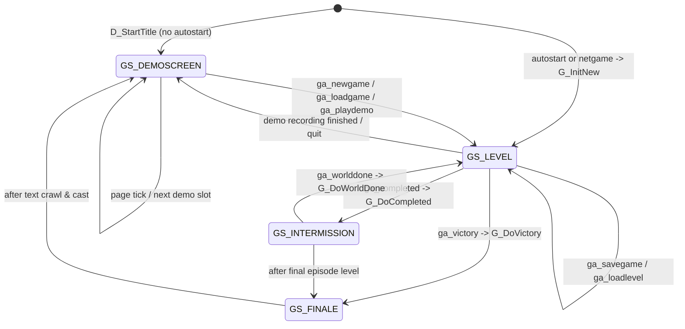
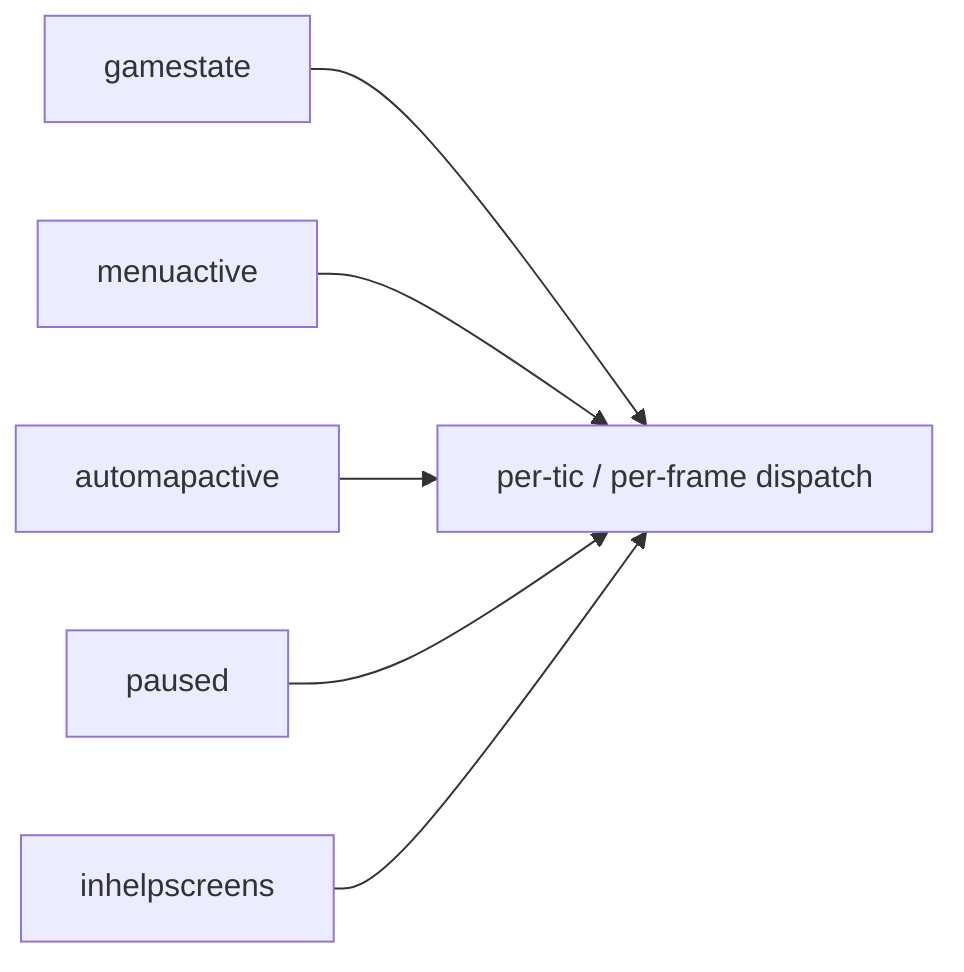

# 12 — Game state machine

DOOM's overall behaviour is a **finite-state machine over four screens**
(`gamestate_t`) coordinated by a deferred-action enum (`gameaction_t`).
Knowing this FSM is how you understand why the menu can still pop up over
the intermission screen, why save-games don't happen mid-tic, and where
demo playback fits in.

Source: [doomdef.h](../linuxdoom-1.10/doomdef.h#L127-L133),
[d_event.h](../linuxdoom-1.10/d_event.h#L53-L65),
[g_game.c](../linuxdoom-1.10/g_game.c).

## The two enums

```c
typedef enum {
    GS_LEVEL,         // playing
    GS_INTERMISSION,  // between-level summary
    GS_FINALE,        // end-of-episode text crawl
    GS_DEMOSCREEN     // title / credits / demo playback
} gamestate_t;

typedef enum {
    ga_nothing,
    ga_loadlevel,
    ga_newgame,
    ga_loadgame,
    ga_savegame,
    ga_playdemo,
    ga_completed,
    ga_victory,
    ga_worlddone,
    ga_screenshot
} gameaction_t;
```

`gamestate_t` answers "what kind of frame are we in right now?"
`gameaction_t` answers "what does the player want to happen at the start of
the next tic?" — it is a **deferred-command queue** of size one. This avoids
ever changing the world mid-tic.

## State diagram



## Per-tic dispatch

Every tic, `G_Ticker` first **flushes the pending `gameaction`** (which can
itself queue another), then dispatches based on `gamestate`:

```mermaid
flowchart TD
    Tic[G_Ticker per tic] --> Flush{gameaction<br/>!= ga_nothing?}
    Flush -- yes --> Apply[G_Do{NewGame,LoadLevel,SaveGame,...}]
    Apply --> Flush
    Flush -- no --> Dispatch{gamestate}
    Dispatch -- GS_LEVEL --> P[P_Ticker<br/>+ ST_Ticker, AM_Ticker, HU_Ticker]
    Dispatch -- GS_INTERMISSION --> WI[WI_Ticker]
    Dispatch -- GS_FINALE --> F[F_Ticker]
    Dispatch -- GS_DEMOSCREEN --> D[D_PageTicker]
```

And the matching draw dispatch in `D_Display`
([d_main.c:235-261](../linuxdoom-1.10/d_main.c#L235-L261)):

```c
switch (gamestate) {
  case GS_LEVEL:        AM_Drawer(); ST_Drawer(); break;
  case GS_INTERMISSION: WI_Drawer();              break;
  case GS_FINALE:       F_Drawer();               break;
  case GS_DEMOSCREEN:   D_PageDrawer();           break;
}
// after case dispatch:
if (gamestate == GS_LEVEL && !automapactive)
    R_RenderPlayerView(...);
M_Drawer();   // menu always drawn on top
```

## Orthogonal modal overlays

These are *modes* layered on top of the gamestate, not states themselves:

| Mode flag         | What it does                                     | Owner   |
|-------------------|--------------------------------------------------|---------|
| `menuactive`      | Menu is on screen; inputs go to `M_Responder`    | m_menu  |
| `automapactive`   | Replace 3D view with map view                    | am_map  |
| `paused`          | Skip all `*_Ticker` calls except `M_Ticker`      | g_game  |
| `inhelpscreens`   | Help screen overlay                              | m_menu  |

They compose freely with `gamestate` because they are tested *inside* the
`*_Ticker` and `*_Drawer` functions. So you can pause during the
intermission, open the menu during a demo, etc.



## The screen-wipe transition

State transitions render a 1990s-classic "melt wipe" — the previous frame
slides down column-by-column at randomised speeds. The wipe is
implemented in [f_wipe.c](../linuxdoom-1.10/f_wipe.c) and engaged from
[d_main.c:222-227, 326-345](../linuxdoom-1.10/d_main.c#L222-L227):

```c
if (gamestate != wipegamestate) {
    wipe = true;
    wipe_StartScreen(0,0,SCREENWIDTH,SCREENHEIGHT);
}
```

Whenever `gamestate` changes (`GS_LEVEL → GS_INTERMISSION → GS_FINALE → ...`)
the wipe runs as an inline blocking animation. Note this animation is a
*display* effect: the simulation is not advancing while it plays, but the
network code (`NetUpdate`) *is* called inside the wipe loop so that peers
do not time out.

## Save and load

`ga_savegame` is a **deferred** command because save data must be a
consistent snapshot of mid-tic state would not be. The flow:

1. Player chooses save in menu → menu sets `gameaction = ga_savegame` and
   exits.
2. Next `G_Ticker` invocation runs `G_DoSaveGame` *before* this tic's
   simulation.
3. `G_DoSaveGame` writes header + zone-managed thinker list + player state
   to disk via [p_saveg.c](../linuxdoom-1.10/p_saveg.c). Pointers are
   serialised as **indexes** into the thinker list — a worked example of
   pointer rebasing.

The takeaway: any "irreversible global change" (load, save, level
transition, exit) is exclusively serviced through `gameaction`. The world
never changes inside `P_Ticker` except as a function of player input.

> Read next: [13 — Portability layer: the i_* abstraction](13_portability.md).
