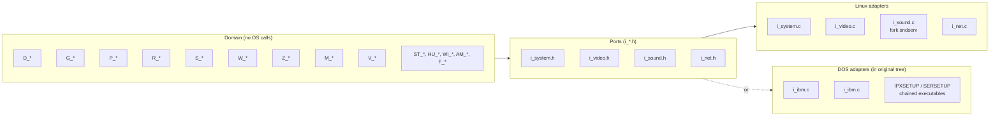

# 13 — Portability layer: the i_* abstraction

DOOM compiles on Linux, DOS, Solaris, IRIX, and (with patches) NeXTSTEP, OS/2
and Windows. The way it achieves this with no `#ifdef` rats' nests in the
game logic is by funnelling **every** OS interaction through the `I_*` API.
The header surface is small, fixed, and platform-neutral; per-platform
implementations live in separately-named source files.

## The hexagonal architecture, 1993 edition

Modern terminology: **ports and adapters** (a.k.a. hexagonal architecture).
DOOM's "domain" — the deterministic simulation — sits in the middle. The
`I_*` headers are the ports. Each platform brings adapters.



In this open-source release, only the Linux adapter set is present. The DOS
files (`i_ibm.c`, `i_pcnet.c`) are listed in the
[FILES](../linuxdoom-1.10/FILES) inventory but were not included. The
network drivers were instead released as separate *programs*:
[ipx/](../ipx/) and [sersrc/](../sersrc/), which set up a `doomcom_t`
shared block and then exec'd DOOM.

## Headers

[i_system.h](../linuxdoom-1.10/i_system.h):

```c
void   I_Init(void);
byte*  I_ZoneBase(int* size);
int    I_GetTime(void);
void   I_StartFrame(void);
void   I_StartTic(void);
ticcmd_t* I_BaseTiccmd(void);
void   I_Quit(void);
byte*  I_AllocLow(int length);
void   I_Tactile(int on, int off, int total);
void   I_Error(char* error, ...);
```

That is the entire system port. Time, memory, frame and tic edges,
controller hooks, error termination. Note how few functions there are.

[i_video.h](../linuxdoom-1.10/i_video.h):

```c
void   I_InitGraphics(void);
void   I_ShutdownGraphics(void);
void   I_SetPalette(byte* palette);   // 768 bytes RGB
void   I_UpdateNoBlit(void);          // composite, no flip
void   I_FinishUpdate(void);          // page flip / present
void   I_ReadScreen(byte* scr);
void   I_BeginRead(void);
void   I_EndRead(void);
```

The contract: there is one global 320×200 byte buffer the game writes into
([v_video.c](../linuxdoom-1.10/v_video.c)'s `screens[0]`); the platform
adapter copies/scales/blits it at `I_FinishUpdate` time. The renderer doesn't
know whether it is targeting an X11 window, an SVGAlib console, or a DGA
DMA buffer.

[i_sound.h](../linuxdoom-1.10/i_sound.h) and
[i_net.h](../linuxdoom-1.10/i_net.h) follow the same minimalist pattern.

## The `doomcom_t` data port

Networking is interesting because it uses a **shared struct** rather than a
function-pointer interface:

```c
typedef struct {
    short  id;
    short  intnum;
    short  command;     // CMD_SEND / CMD_GET
    short  remotenode;
    short  datalength;
    short  numnodes;
    short  ticdup;
    short  extratics;
    short  deathmatch;
    short  savegame;
    short  episode, map, skill;
    short  consoleplayer;
    short  numplayers;
    short  angleoffset;
    short  drone;
    short  ticcmd[MAXPLAYERS][BACKUPTICS]; // unused on Linux build
    doomdata_t data;
} doomcom_t;
```

This is the seam between `d_net.c` and the transport. The platform adapter
fills in `numnodes`, `consoleplayer`, etc., and wires `command` semantics:
when `d_net.c` wants to send, it sets `command=CMD_SEND` and triggers an
interrupt or callback.

## Why no virtual dispatch?

A modern equivalent would use a `struct vtable` of function pointers. DOOM
relies on the **linker** instead: the build system links exactly one
implementation of each `I_*` symbol. There is no way to swap adapters at
runtime. That is fine because the choice is at compile time anyway. The
benefit is that `I_GetTime` is a direct call — no function pointer
indirection, no branch — which matters when it is called every frame.

This is a pre-runtime polymorphism choice. The cost is that you cannot
unit-test the engine with a mock platform without a separate build. The
benefit is straight-line code with no dispatch overhead.

## What lives in the linuxdoom adapter

| File | Implements |
|------|------------|
| [i_main.c](../linuxdoom-1.10/i_main.c) | tiny `main` that calls `D_DoomMain` |
| [i_system.c](../linuxdoom-1.10/i_system.c) | `I_Init`, `I_GetTime` (gettimeofday), `I_ZoneBase` (malloc), `I_Error` (fprintf+exit) |
| [i_video.c](../linuxdoom-1.10/i_video.c) | X11 + MIT SHM (or DGA) graphics, keyboard, mouse |
| [i_sound.c](../linuxdoom-1.10/i_sound.c) | fork/pipe to `sndserv` |
| [i_net.c](../linuxdoom-1.10/i_net.c) | UDP socket, packet send/recv, doomcom fill-in |

That is roughly **60 KB of C** that, if rewritten for any other OS,
delivers a working port. This is the smallest possible "port footprint" for
a graphical real-time game.

## Lessons

- **Define the port before you have an adapter.** A small port survives
  decades; a port designed by accident around the first OS it ran on does
  not.
- **Prefer compile-time selection over runtime indirection** when the set
  of choices is finite and known. Save dynamic dispatch for genuine runtime
  polymorphism.
- **Use processes as adapters when threading is a portability liability.**
  Sound and DOS networking both did this. Today the analogue is per-platform
  helper binaries (e.g. Steam's overlay process) or microservices.
- **Limit the abstraction surface.** DOOM does not abstract over the file
  system, the network protocol, or the audio mixer in detail — each is
  reduced to one or two functions. A bigger surface makes adapters harder
  to write.

> Read next: [14 — Cross-cutting concerns and lessons](14_lessons.md).
